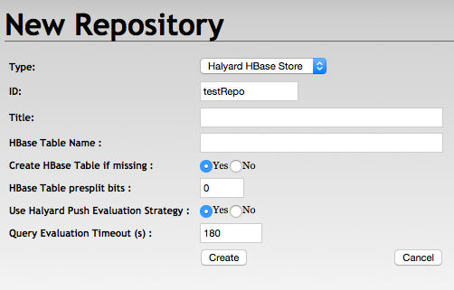
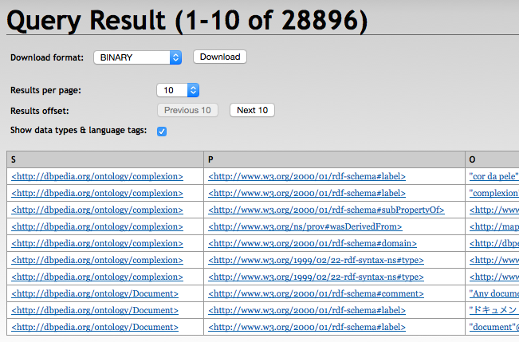
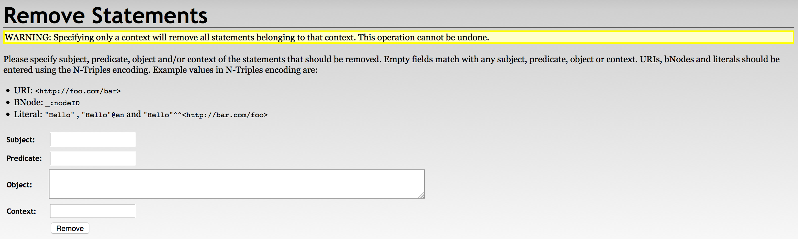

---
---
# Halyard

Halyard is an extremely horizontally scalable [Triplestore][] with support for [Named Graphs][], designed for integration of extremely large [Semantic Data Models][], and for storage and [SPARQL 1.1][] querying of the whole [Linked Data][] universe snapshots. Halyard implementation is based on [Eclipse RDF4J][] framework and [Apache HBase][] database, and it is completely written in Java.

*Author: [Adam Sotona](mailto:adam.sotona@merck.com)*

[Triplestore]: https://en.wikipedia.org/wiki/Triplestore
[Named Graphs]: https://en.wikipedia.org/wiki/Named_graph
[RDF]: https://en.wikipedia.org/wiki/Resource_Description_Framework
[Semantic Data Models]: https://en.wikipedia.org/wiki/Semantic_data_model
[SPARQL 1.1]: http://www.w3.org/TR/sparql11-query/
[Linked Data]: https://en.wikipedia.org/wiki/Linked_data
[Eclipse RDF4J]: http://rdf4j.org
[Apache HBase]: http://hbase.apache.org

---
Important Links

*Home Page: <https://merck.github.io/Halyard>*  
*GitHub Repository: <https://github.com/Merck/Halyard>*  
*Discussion Group: <https://groups.google.com/d/forum/halyard-users>*  
*Integration Builds: <https://travis-ci.org/Merck/Halyard>*  
*Test Coverage Reports: <https://codecov.io/gh/Merck/Halyard>*

[&#9650;](#)

Repository Content
------------------

 * **Halyard-Common** - a library for direct mapping between RDF data model and Apache HBase
 * **Halyard-Strategy** - a generic parallel asynchronous implementation of RDF4J Evaluation Strategy
 * **Halyard-SAIL** - an implementation of the RDF4J Storage and Inference Layer on top of Apache HBase
 * **Halyard Tools** - a set of command line and Apache Hadoop MapReduce tools for loading, updating, querying, and exporting the data with maximum performance
 * **Halyard-SDK** - a distributable bundle of Eclipse RDF4J and Halyard for command line use on an Apache Hadoop cluster with configured HBase.
 * **Halyard-WebApps** - a re-distribution of Eclipse RDF4J Web Applications (RDF4J-Server and RDF4J-Workbench), patched and enhanced to include Halyard as another RDF repository option

[&#9650;](#)

Architecture Diagram
--------------------


[&#9650;](#)

Build Instructions
------------------
Build environment prerequisites are:

 * Linux or Mac computer
 * Java SE Development Kit 8
 * Apache Maven software project management and comprehension tool

In the Halyard project root directory execute command: `mvn package`

Optionally you can build Halyard from NetBeans or other Java Development IDE.

[&#9650;](#)

Runtime Requirements
--------------------
Halyard is expected to run on an Apache Hadoop cluster node with configured Apache HBase client. Apache Hadoop and Apache HBase components are not bundled with Halyard. The runtime requirements are:

 * Apache Hadoop version 2.5.1 or higher
 * Apache HBase version 1.1.2 or higher
 * Java 8 Runtime

*Note: Recommended Apache Hadoop distribution is Hortonworks Data Platform (HDP) version 2.4.2*

[&#9650;](#)

Halyard SDK
-----------

### Installation
Download and unzip the latest `halyard-sdk-<version>.zip` bundle to a Apache Hadoop cluster node with configured Apache HBase client.

[&#9650;](#)

### RDF4J Console

RDF4J Console is a command line interactive application providing set of commands to operate several supported RDF4J SAIL implementations. Halyard (HBase SAIL) is included in this distribution.

The SAILs are executed within the Console local context by default or the Console can be used to connect to a remote server endpoint.

The Console represents all-in-one user solution for experiments with various SAILs (in-memory or local filesystem based) as well as for Halyard (HBase SAIL) cluster connection. For use with Halyard (HBase SAIL) it is mandatory to execute the Console on a Hadoop & HBase configured cluster node.  


**Console Usage:**

1. Open terminal on a Hadoop cluster node with configured HBase
2. On a secured cluster don't forget to `kinit` with your credentials
3. You may optionally run `hbase shell` tool and for example `list` command to verify HBase connection and configuration
4. Start `console` application from unzipped Halyard bundle
5. `create hbase` repository type that will map to the local HBase under your actual credentials. Repository template called `hbase` is added by Halyard to the standard set of RDF4J repository templates: `memory`, `native`, `remote`, etc... Don't be mistaken by **creation** of your local repository instance, it is just an instance of connection settings to a HBase table. You may point multiple repository instances under various repository IDs to a single shared HBase table. Created instance is locally persisted under the actual user home folder so this step does not have to be repeated. HBase repository settings are described in [this chapter](#settings).
6. `open <your repository ID>` - this is the time when Halyard connects to the associated HBase table or creates the table if missing (and if instructed to do so).
7. General RDF4J Console usage is available under `help` command or at: <http://docs.rdf4j.org/server-workbench-console/#_rdf4j_console>

[&#9650;](#)

### Halyard Bulk Load

Halyard Bulk Load is a Map Reduce application designed to efficiently load RDF data from Hadoop Filesystem (HDFS) into HBase in a form of Halyard dataset.

Halyard Bulk Load consumes RDF data files of various formats supported by RDF4J RIO, including:

* Binary RDF (.brf)
* Json-LD (.jsonld)
* N3 (.n3)
* N-Quads (.nq)
* N-Triples (.nt)
* RDFa (.xhtml, .html)
* RDF Json (.rj)
* RDF XML (.rdf, .rdfs, .owl, .xml)
* TriG (.trig)
* TriX (.xml, .trix)
* Turtle (.ttl)

All the supported RDF formats can be also compressed with one of the compression codecs supported by Hadoop, including:

* Gzip (.gz)
* Bzip2 (.bz2)
* LZO(.lzo)
* Snappy (.snappy)


**Bulk Load Usage:**

1. Open terminal on a Hadoop cluster node with configured HBase.
2. On a secured cluster don't forget to `kinit` with your credentials.
3. You may optionally execute `hdfs dfs -ls -R <path_to_RDF_files>` command to verify your RDF files location and access.
4. Execute `./bulkload <input_path(s)_of_the_RDF_files> <temporary_path_for_HTable files> <HBase_table_name>` to launch the Bulk Load application. Following features are supported:
	* More input paths can be delimited by comma.
	* The input paths are searched for the supported files recurrently.
	* Temporary path for HTable files is used to store temporary HBase table files and the files are moved to their final HBase locations during the last stage of the Bulk Load process.
	* Optional property `-Dmapreduce.job.queuename=<YARN_queue_name>` can specify YARN queue to be used by the application.
	* Optional property `-Dhalyard.parser.skipinvalid=true` can be used to continue the Bulk Load process even in case of RDF parsing exceptions for particular files.
	* Optional property `-Dhalyard.table.splitbits=<split_bits>` can specify number of pre-computed HBase table region splits when the table does not exist yet and it is created during the Bulk Load. Number of table pre-splits is calculated as 3 * 2^\<split_bits>. Default number of split_bits is 0, so each new Hbase table is pre-split into 3 regions by default. Use this option wisely as a large number of table pre-splits can overload HBase as well as significantly affect Bulk Load performance.
	* Optional property `-Dhalyard.parser.context.default=<default graph context>` can specify default graph context for the ingested RDF triples
	* Optional property `-Dhalyard.parser.context.override=true` can override graph context of the loaded RDF quads with the default graph context  
5. Executed process will inform you about the tracking URL of the Map Reduce application and about the bulk load progress.

[&#9650;](#)

### Halyard Hive Load

Halyard Hive Load is a Map Reduce application designed to efficiently load RDF data from Apache Hive table into HBase in a form of Halyard dataset. It has similar functionality to Halyard Bulk Load, just instead of parsing files from HDFS it parses content of all cells from specified Hive table and column.

Halyard Hive Load consumes RDF data files of various formats supported by RDF4J RIO, similar to Halyard Bulk Load, however it does not support compression. Following RDF4J RIO MIME types are supported:

 * application/rdf+xml (application/xml, text/xml)
 * application/n-triples (text/plain)
 * text/turtle (application/x-turtle)
 * text/n3 (text/rdf+n3)
 * application/trix
 * application/trig (application/x-trig)
 * application/x-binary-rdf
 * application/n-quads (text/x-nquads, text/nquads)
 * application/ld+json
 * application/rdf+json
 * application/xhtml+xml (application/html, text/html)


**Hive Load Usage:**

1. Open terminal on a Hadoop cluster node with configured HBase.
2. On a secured cluster don't forget to `kinit` with your credentials.
3. Use Apache Hive client to verify access to your table and index of the column with RDF data.
4. Execute `./hiveload -Dhalyard.rdf.mime.type='<RDF_MIME_Type>' -Dhalyard.hive.data.column.index=<column_index> <Hive_table_name> <temporary_path_for_HTable files> <HBase_table_name>` to launch the Hive Load application. Following features are supported:
	* Temporary path for HTable files is used to store temporary HBase table files and the files are moved to their final HBase locations during the last stage of the Bulk Load process.
	* Optional property `-Dmapreduce.job.queuename=<YARN_queue_name>` can specify YARN queue to be used by the application.
	* Optional property `-Dhalyard.parser.skipinvalid=true` can be used to continue the Bulk Load process even in case of RDF parsing exceptions for particular files.
	* Optional property `-Dhalyard.table.splitbits=<split_bits>` can specify number of pre-computed HBase table region splits when the table does not exist yet and it is created during the Bulk Load. Number of table pre-splits is calculated as 3 * 2^\<split_bits>. Default number of split_bits is 0, so each new Hbase table is pre-split into 3 regions by default. Use this option wisely as a large number of table pre-splits can overload HBase as well as significantly affect Bulk Load performance.
	* Optional property `-Dhalyard.parser.context.default=<default graph context>` can specify default graph context for the ingested RDF triples
	* Optional property `-Dhalyard.parser.context.override=true` can override graph context of the loaded RDF quads with the default graph context  
5. Executed process will inform you about the tracking URL of the Map Reduce application and about the bulk load progress.

[&#9650;](#)

### Halyard Update

Halyard Update is a command line application designed to run SPARQL Update queries to update data in HBase Halyard dataset.


**Update Usage:**

1. Open terminal on a Hadoop cluster node with configured HBase.
2. On a secured cluster don't forget to `kinit` with your credentials.
3. Execute `./update -s <HBase_table_name> -q '<sparql_query>'` to launch the update.

[&#9650;](#)

### Halyard Export

Halyard Export is a command line application designed to export data from HBase (from Halyard dataset) into various targets and in various forms.

The exported data are determined by a SPARQL query. The SPARQL query can be of Tuple Query Type to produce a set of tuples (a table) or it can be of Graph Query Type to produce a set of triples (a graph).

Supported target systems, query types, formats and compressions are listed in the following table:

Target            | Protocol | Tuple Query                     | Graph Query
----------------- | -------- | ------------------------------- | -----------
Local Filesystem  | file:    | CSV with optional compressions  | RDF4J RIO supported RDF formats with optional compressions
Hadoop Filesystem | hdfs:    | CSV with optional compressions  | RDF4J RIO supported RDF formats with optional compressions
Database          | jdbc:    | direct mapping to table columns | ~~not supported~~

Optional compressions are:

* Bzip2 (.bz2)
* Gzip (.gz)

RDF4J RIO supported RDF formats are:


* Binary RDF (.brf)
* Json-LD (.jsonld)
* N3 (.n3)
* N-Quads (.nq)
* N-Triples (.nt)
* RDFa (.xhtml, .html)
* RDF Json (.rj)
* RDF XML (.rdf, .rdfs, .owl, .xml)
* TriG (.trig)
* TriX (.xml, .trix)
* Turtle (.ttl)


**Export Usage:**

1. Open terminal on a Hadoop cluster node with configured HBase.
2. On a secured cluster don't forget to `kinit` with your credentials.
3. Execute `./export -s <HBase_table_name> -q '<sparql_query>' -t <target_URL>` to launch the export. Following features are supported:
	* Target file format and optional compression (for file: and hdfs: targets) is determined from the target file extension.
	* Target table name (for jdbc: targets) must be added behind the additional slash at the end of the standard JDBC URL connection string.
	* SPARQL query type must match the target URL (and the target file type if applicable)
	* Option `-c <driver_class>` is mandatory for jdbc: targets to determine the JDBC Driver class used to connect the target.
	* Option `-l <driver_classpath>` allows to specify additional Java classpath necessary to load particular JDBC driver for jdbc: targets.
	* Options `-p <property=value>` allows to pass additional properties to JDBC connections for jdbc: targets. The most frequent JDBC connectin properties are: `-p user=<jdbc_connection_username>` and `-p password=<jdbc_connection_password>`.
	* Option `-r` trims jdbc: target table before export

[&#9650;](#)

### Halyard Parallel Export

Halyard Parallel Export is a MapReduce application executing multiple Halyard Exports in multiple Map tasks across Hadoop cluster. All the exports are instructed with the same SPARQL query, the same target and the same options. Parallelisation is done using a custom SPARQL filter function `parallel_split_by(?a_binding)`. The function takes one or more bindings as argument(s) and these bindings are used as a key(s) to randomly distribute the query evaluation across all mappers.


**Parallel Export Usage:**

1. Open terminal on a Hadoop cluster node with configured HBase.
2. On a secured cluster don't forget to `kinit` with your credentials.
3. Execute `./pexport -Dmapreduce.job.maps=<number_of_maps> -s <HBase_table_name> -q '<sparql_query>' -t <target_URL>` to launch the export. Following features are supported:
	* Target file format and optional compression (for file: and hdfs: targets) is determined from the target file extension.
	* Target table name (for jdbc: targets) must be added behind the additional slash at the end of the standard JDBC URL connection string.
	* Target file name (for file: and hdfs: targets) must contain a parallel index marker `{0}` anywhere withing the path to avoid parallel write conflicts and exported data corruption.
	* SPARQL query type must match the target URL (and the target file type if applicable)
	* Option `-c <driver_class>` is mandatory for jdbc: targets to determine the JDBC Driver class used to connect the target.
	* Option `-l <driver_classpath>` allows to specify additional Java classpath necessary to load particular JDBC driver for jdbc: targets.
	* Options `-p <property=value>` allows to pass additional properties to JDBC connections for jdbc: targets. The most frequent JDBC connectin properties are: `-p user=<jdbc_connection_username>` and `-p password=<jdbc_connection_password>`.

[&#9650;](#)

RDF4J Web Applications
----------------------

### Installation

1. Install Apache Tomcat 8 (or similar) server on a configured Hadoop and HBase cluster node
2. On a secured cluster create a service account and assign it adequate permissions for HDFS and HBase. Don't forget to setup a process to assure the user running the Apache Tomcat is always authenticated in Kerberos.
3. Secure the Apache Tomcat server as necessary.
4. Add Apache Hadoop and Apache HBase classpath to the Tomcat classpath by ceating `setenv.sh` file in the Apache Tomcat `bin` folder, with content: ``` export CLASSPATH="$CATALINA_HOME/lib/servlet-api.jar:"`hadoop classpath`:`hbase classpath` ```
5. Download `rdf4j-server.war` and `rdf4j-workbench.war` application bundles from Halyard distribution into the Apache Tomcat (into folder `webapps`).
6. Start the Apache Tomcat server (if not already started) and check logs if both applications started correctly.
7. Open Web browser and verify connection to `<Apache_Tomcat_address>/rdf4j-workbench` by creating a repository. If server authentication is enabled, you have to enter the credentials into the workbench to allow connections between rdf4j-workbench and rdf4j-server applications. Also entering the right location of the `<Apache_Tomcat_address>/rdf4j-server` into the workbench might be required.
8. More information about RDF4J Server and Workbench can be found here: <http://docs.rdf4j.org/server-workbench-console>

[&#9650;](#)

### RDF4J Server

RDF4J Server is a service server providing SPARQL Endpoint for each managed repository as well as the REST access to the repository management functions.

More details about the RDF4J REST Protocol are described here: <http://docs.rdf4j.org/rest-api/>

[&#9650;](#)

### RDF4J Workbench


RDF4J Workbench is a web client application for the RDF4J Server. It provides a nice user interface to manage the repositories, load, query, update and explorer RDF data of the connected RDF4J Server. More information about RDF4J Workbench can be found here: <http://docs.rdf4j.org/server-workbench-console/#_rdf4j_workbench>

[&#9650;](#)

Standard Use Cases
==================

Note about Repositories versus Datasets
---------------------------------------
RDF4J repositories represent just configured connectors to the particular RDF storage. The repositories are always created and persisted within the actual context. RDF4J Console repository configuration is persisted under the actual user home directory. Repositories created through RDF4J Workbench exist within the actually connected RDF4J Server context only.

Halyard Datasets with all the RDF data are persisted within the HBase tables. Corresponding Halyard Dataset can be optionally created together with repository creation.

Multiple repositories configured in various RDF4J Servers or in multiple RDF4J Consoles can share one common Halyard Dataset and so pint to the same HBase table.

**Deletion of the repository** from one particular RDF4J Server or RDF4J Console does not delete Halyard Dataset and so it does not affect the data and other users. However **clearing** the repository or **deletion of the statements** has global effect for all users.  

[&#9650;](#)

<a name="settings"></a>
HBase Repository Settings
-------------------------

**Repository ID** - is mandatory and may correspond to the HBase table name  
**Repository title** - is optional  
**HBase Table Name** - may be left empty when the table name corresponds to the Rpository ID  
**Create HBase Table if missing** - table presplit bits are ignored in case the table is not created   
**HBase Table presplit bits** - keep the default 0 unless you expect a very big dataset  
**Use Halyard Push Evaluation Strategy** - may be set to false to fallback to the default RDF4J Evaluation Strategy implementation  
**Query Evaluation Timeout** - may be adjusted or set to 0, however it creates a risk of resources exhaustion

[&#9650;](#)

Create Repository
-----------------

**With RDF4J Console**

```
> create hbase
Please specify values for the following variables:
Repository ID: testRepo
Repository title:
HBase Table Name:
Create HBase Table if missing (true|false) [true]:
HBase Table presplit bits [0]:
Use Halyard Push Evaluation Strategy (true|false) [true]:
Query Evaluation Timeout [180]:
Repository created
```

**With RDF4J Workbench**



[&#9650;](#)

Connect to Existing Repository
------------------------------

**From RDF4J Console**

```
> open testRepo
Opened repository 'testRepo'
```

**From RDF4J Workbench**

Just select the repository from the list of repositories.

Newly created repository is automatically connected in RDF4J Workbench.

[&#9650;](#)

Load RDF Data
-------------

**With Halyard Bulk Load**

```
> ./bulkload /my_hdfs_path/my_triples.owl /my_hdfs_temp_path testRepo
impl.YarnClientImpl: Submitted application application_1458475483810_40875
mapreduce.Job: The url to track the job: http://my_app_master/proxy/application_1458475483810_40875/
mapreduce.Job:  map 0% reduce 0%
mapreduce.Job:  map 100% reduce 0%
mapreduce.Job:  map 100% reduce 100%
mapreduce.Job: Job job_1458475483810_40875 completed successfully
INFO: Bulk Load Completed..
```
Note: skipping a lot of debugging information from the Map Reduce execution

**With Halyard Hive Load**

```
> ./hiveload -Dhalyard.rdf.mime.type='application/n-triples' -Dhalyard.hive.data.column.index=3 my_hive_table /my_hdfs_temp_path testRepo
impl.YarnClientImpl: Submitted application application_1514793734614_41673
mapreduce.Job: The url to track the job: http://my_app_master/proxy/application_1514793734614_41673/
mapreduce.Job:  map 0% reduce 0%
mapreduce.Job:  map 100% reduce 0%
mapreduce.Job:  map 100% reduce 100%
mapreduce.Job: Job job_1514793734614_41673 completed successfully
INFO: Hive Load Completed..
```
Note: skipping a lot of debugging information from the Map Reduce execution

**With RDF4J Console**

```
testRepo> load /home/user/my_triples.owl
Loading data...
Data has been added to the repository (2622 ms)
```

**With RDF4J Workbench**


**With RDF4J Server SPARQL Endpoint REST APIs**

```
PUT /rdf4j-server/repositories/testRepo/statements HTTP/1.1
Content-Type: application/rdf+xml;charset=UTF-8

[RDF/XML ENCODED RDF DATA]
```

[&#9650;](#)

SPARQL Update
-------------

**With Halyard Update**

```
./update -s testRepo -q 'insert {?s ?p ?o} where {?s ?p ?o}'
```

**With RDF4J Console**

```
testRepo> sparql
enter multi-line SPARQL query (terminate with line containing single '.')
insert {?s ?p ?o} where {?s ?p ?o}
.
Executing update...
Update executed in 800 ms
```

**With RDF4J Workbench**


**With RDF4J Server SPARQL Endpoint REST APIs**

```
POST /rdf4j-server/repositories/testRepo/statements HTTP/1.1
Content-Type: application/x-www-form-urlencoded

update=INSERT%20{?s%20?p%20?o}%20WHERE%20{?s%20?p%20?o}
```

[&#9650;](#)

SPARQL Query and Export Data
----------------------------

**With Halyard Export**

```
> ./export -s testRepo -q 'select * where {?s ?p ?o}' -t file:///my_path/my_export.csv
INFO: Query execution started
INFO: Export finished
```
Note: additional debugging information may appear in the output of the export execution

**With Halyard Parallel Export**

```
> ./pexport -Dmapreduce.job.maps=10 -s testRepo -q 'PREFIX hlyd: <http://gin.msd.com/halyard/> select * where {?s ?p ?o . FILTER (hlyd:parallel_split_by (?s))}' -t hdfs:///my_path/my_export{0}.csv
impl.YarnClientImpl: Submitted application application_1572718538572_94727
mapreduce.Job: The url to track the job: http://my_app_master/proxy/application_1572718538572_94727/
mapreduce.Job:  map 0% reduce 0%
mapreduce.Job:  map 100% reduce 0%
mapreduce.Job: Job job_1572718538572_94727 completed successfully
INFO: Parallel Export Completed..
```

**With RDF4J Console**

```
testRepo> sparql
enter multi-line SPARQL query (terminate with line containing single '.')
select * where {?s ?p ?o} limit 10
.
Evaluating SPARQL query...
+------------------------+------------------------+------------------------+
| s                      | p                      | o                      |
+------------------------+------------------------+------------------------+
| :complexion            | rdfs:label             | "cor da pele"@pt       |
| :complexion            | rdfs:label             | "complexion"@en        |
| :complexion            | rdfs:subPropertyOf     | dul:hasQuality         |
| :complexion            | prov:wasDerivedFrom    | <http://mappings.dbpedia.org/index.php/OntologyProperty:complexion>|
| :complexion            | rdfs:domain            | :Person                |
| :complexion            | rdf:type               | owl:ObjectProperty     |
| :complexion            | rdf:type               | rdf:Property           |
| :Document              | rdfs:comment           | "Any document"@en      |
| :Document              | rdfs:label             | "\u30C9\u30AD\u30E5\u30E1\u30F3\u30C8"@ja|
| :Document              | rdfs:label             | "document"@en          |
+------------------------+------------------------+------------------------+
10 result(s) (51 ms)
```

**With RDF4J Workbench**





**With RDF4J Server SPARQL Endpoint REST APIs**

```
GET /rdf4j-server/repositories/testRepo?query=select+*+where+%7B%3Fs+%3Fp+%3Fo%7D HTTP/1.1
Accept: application/sparql-results+xml, */*;q=0.5
```

[&#9650;](#)

Delete Statements
-----------------
**With RDF4J Update**

```
./update -s testRepo -q 'delete {?s ?p ?o} where {?s ?p ?o}'
```

**With RDF4J Workbench**



**With RDF4J Server SPARQL Endpoint REST APIs**

```
DELETE /rdf4j-server/repositories/testRepo/statements?subj=&pred=&obj= HTTP/1.1

```

[&#9650;](#)

Clear Repository
----------------

**With RDF4J Console**

```
testRepo> clear
Clearing repository...
```

**With RDF4J Workbench**


**With RDF4J Server SPARQL Endpoint REST APIs**

```
DELETE /rdf4j-server/repositories/testRepo/statements HTTP/1.1

```

[&#9650;](#)

HBase Shell Dataset Operations
------------------------------

### Snapshot Halyard Dataset
```
> hbase shell
HBase Shell; enter 'help<RETURN>' for list of supported commands.
Type "exit<RETURN>" to leave the HBase Shell
Version 1.1.2.2.4.2.0-258

hbase(main):001:0> snapshot 'testRepo', 'testRepo_my_snapshot'
0 row(s) in 36.3380 seconds
```

[&#9650;](#)

### Clone Halyard Dataset from Snapshot
```
> hbase shell
HBase Shell; enter 'help<RETURN>' for list of supported commands.
Type "exit<RETURN>" to leave the HBase Shell
Version 1.1.2.2.4.2.0-258

hbase(main):001:0> clone_snapshot 'testRepo_my_snapshot', 'testRepo2'
0 row(s) in 31.1590 seconds
```

[&#9650;](#)

### Export Halyard Dataset Snapshot
```
> hbase org.apache.hadoop.hbase.snapshot.ExportSnapshot -snapshot testRepo_my_snapshot -copy-to /my_hdfs_export_path
2016-04-28 09:01:07,019 INFO  [main] snapshot.ExportSnapshot: Loading Snapshot hfile list
2016-04-28 09:01:07,427 INFO  [main] snapshot.ExportSnapshot: Copy Snapshot Manifest
2016-04-28 09:01:11,704 INFO  [main] impl.YarnClientImpl: Submitted application application_1458475483810_41563
2016-04-28 09:01:11,826 INFO  [main] mapreduce.Job: The url to track the job: http://my_app_master/proxy/application_1458475483810_41563/
2016-04-28 09:01:19,956 INFO  [main] mapreduce.Job:  map 0% reduce 0%
2016-04-28 09:01:29,031 INFO  [main] mapreduce.Job:  map 100% reduce 0%
2016-04-28 09:01:29,039 INFO  [main] mapreduce.Job: Job job_1458475483810_41563 completed successfully
2016-04-28 09:01:29,158 INFO  [main] snapshot.ExportSnapshot: Finalize the Snapshot Export
2016-04-28 09:01:29,164 INFO  [main] snapshot.ExportSnapshot: Verify snapshot integrity
2016-04-28 09:01:29,193 INFO  [main] snapshot.ExportSnapshot: Export Completed: testRepo_my_snapshot
```
Note: skipping a lot of debugging information from the Map Reduce excution

[&#9650;](#)

### Bulk Merge of Multiple Datasets

**1. Snapshot and Export all Halyard Datasets you want to merge**

(see the above described processes)

**2. Merge the exported files**

Exported HBase files are organised under the target folder in the following structure:
`/archive/data/<table_namespace>/<table_name>/<region_id>/<column_family>/<region_files>`

We need to merge the region files under each column family from all exports into a single structure.

As Halyard Dataset currently contains the only `e` column family, it can be achieved for example by following commands:

```
> hdfs dfs -mkdir -p /my_hdfs_merged_path/e
> hdfs dfs -mv /my_hdfs_export_path/archive/data/*/*/*/e/* /my_hdfs_merged_path/e
```
**3. Create a new Halyard Dataset**

(see the above described process)

**4. Load the merged files**

```
> hbase org.apache.hadoop.hbase.mapreduce.LoadIncrementalHFiles /my_hdfs_merged_path new_dataset_table_name
```

[&#9650;](#)

### Boost Query Performance by Making the Dataset Read-only
```
> hbase shell
HBase Shell; enter 'help<RETURN>' for list of supported commands.
Type "exit<RETURN>" to leave the HBase Shell
Version 1.1.2.2.4.2.0-258

hbase(main):001:0> alter 'testRepo', READONLY => 'true'
Updating all regions with the new schema...
0/3 regions updated.
3/3 regions updated.
Done.
0 row(s) in 2.2210 seconds
```

[&#9650;](#)

### Disable/Enable Unused Dataset to Save HBase Resources
```
> hbase shell
HBase Shell; enter 'help<RETURN>' for list of supported commands.
Type "exit<RETURN>" to leave the HBase Shell
Version 1.1.2.2.4.2.0-258

hbase(main):001:0> disable 'testRepo'
0 row(s) in 1.3040 seconds
```

```
> hbase shell
HBase Shell; enter 'help<RETURN>' for list of supported commands.
Type "exit<RETURN>" to leave the HBase Shell
Version 1.1.2.2.4.2.0-258

hbase(main):001:0> enable 'testRepo'
0 row(s) in 1.2130 seconds
```

[&#9650;](#)

### Delete Dataset

```
> hbase shell
HBase Shell; enter 'help<RETURN>' for list of supported commands.
Type "exit<RETURN>" to leave the HBase Shell
Version 1.1.2.2.4.2.0-258

hbase(main):001:0> disable 'testRepo'
0 row(s) in 1.2750 seconds

hbase(main):002:0> drop 'testRepo'
0 row(s) in 0.2070 seconds
```

[&#9650;](#)
