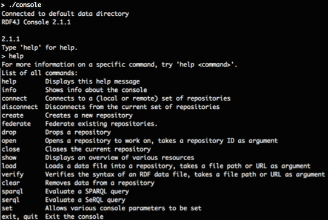
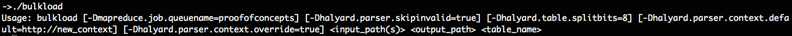
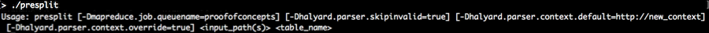
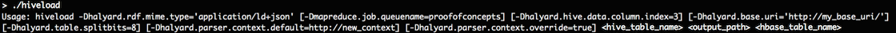
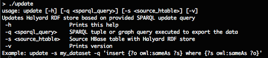
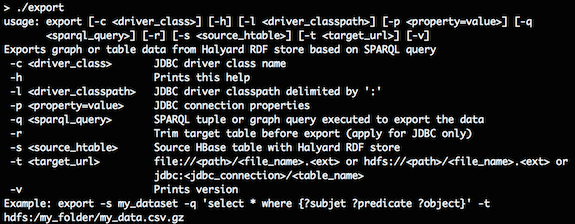
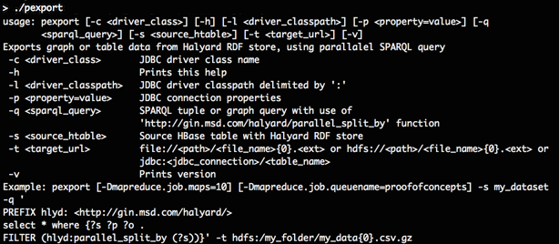
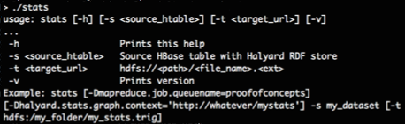
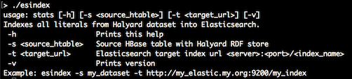

# Tools

### Installation

Download and unzip the latest `halyard-sdk-<version>.zip` bundle to an Apache Hadoop cluster node with a configured Apache HBase client.

### RDF4J Console

RDF4J Console is a command-line interactive application that provides a set of commands to operate several supported RDF4J SAIL implementations. Halyard (HBase SAIL) is included in this distribution.

The SAILs are executed within the Console local context by default or the Console can be used to connect to a remote server endpoint.

The Console represents an all-in-one user solution for experiments with various SAILs (based in-memory or on a local filesystem) as well as for Halyard (HBase SAIL) cluster connection. For use with Halyard (HBase SAIL) it is mandatory to execute the Console on a Hadoop & HBase configured cluster node.



**Console usage:**

1. Open terminal on a Hadoop cluster node with a configured HBase.
2. Don't forget to `kinit` with your credentials if on a secured cluster.
3. You may optionally run the `hbase shell` tool and, for example, use the `list` command to verify the HBase connection and configuration.
4. Start `console` application from the unzipped Halyard bundle.
5. `create hbase` repository type that will map to the local HBase under your actual credentials. The repository template called `hbase` is added by Halyard to the standard set of RDF4J repository templates: `memory`, `native`, `remote`, etc. Don't be mistaken by **creation** of your local repository instance, it is just an instance of the connection settings to an HBase table. You may point multiple repository instances under various repository IDs to a single shared HBase table. The created instance is locally persisted under the actual user's home folder, so this step does not have to be repeated. The HBase repository settings are described in [this chapter](#settings).
6. `open <your repository ID>` - this is the time when Halyard connects to the associated HBase table or creates the table if missing (and if instructed to do so).
7. The instructions for the general use of the RDF4J Console are available via the `help` command or at: <http://docs.rdf4j.org/server-workbench-console/#_rdf4j_console>

### Halyard Bulk Load

Halyard Bulk Load is a MapReduce application designed to efficiently load RDF data from Hadoop Filesystem (HDFS) into HBase in the form of a Halyard dataset.

Halyard Bulk Load consumes RDF files in various formats supported by [RDF4J RIO](http://docs.rdf4j.org/programming/#_parsing_and_writing_rdf_with_rio), including:

* Binary RDF (.brf)
* Json-LD (.jsonld)
* N3 (.n3)
* N-Quads (.nq)
* N-Triples (.nt)
* RDFa (.xhtml, .html)
* RDF JSON (.rj)
* RDF XML (.rdf, .rdfs, .owl, .xml)
* TriG (.trig)
* TriX (.xml, .trix)
* Turtle (.ttl)

All the supported RDF formats can be also compressed with one of the compression codecs supported by Hadoop, including:

* Gzip (.gz)
* Bzip2 (.bz2)
* LZO (.lzo)
* Snappy (.snappy)



**Bulk Load usage:**

1. Open terminal on a Hadoop cluster node with a configured HBase.
2. Don't forget to `kinit` with your credentials if on a secured cluster.
3. You may optionally execute `hdfs dfs -ls -R <path_to_RDF_files>` command to verify your RDF files location and access.
4. Execute `./bulkload <input_path(s)_of_the_RDF_files> <temporary_path_for_HTable files> <HBase_table_name>` to launch the Bulk Load application. Following features are supported:
	* More input paths can be delimited by comma.
	* The input paths are searched for the supported files recurrently.
	* Temporary path for HTable files is used to store temporary HBase table files and the files are moved to their final HBase locations during the last stage of the Bulk Load process.
	* Optional property `-Dmapreduce.job.queuename=<YARN_queue_name>` can specify YARN queue to be used by the application.
	* Optional property `-Dhalyard.parser.skipinvalid=true` can be used to continue the Bulk Load process even in case of RDF parsing exceptions for particular files.
	* Optional property `-Dhalyard.table.splitbits=<split_bits>` can specify number of pre-computed HBase table region splits when the table does not exist yet and it is created during the Bulk Load. Number of table pre-splits is calculated as 3 * 2^\<split_bits>. Default number of split_bits is 0, so each new HBase table is pre-split into 3 regions by default. Use this option wisely as a large number of table pre-splits can overload HBase as well as significantly affect Bulk Load performance.
	* Optional property `-Dhalyard.parser.context.default=<default graph context>` can specify default graph context for the ingested RDF triples
	* Optional property `-Dhalyard.parser.context.override=true` can override graph context of the loaded RDF quads with the default graph context
5. Executed process will inform you about the tracking URL of the MapReduce application and about the bulk load progress.

### Halyard PreSplit

Halyard PreSplit is a MapReduce application designed to estimate optimal HBase region splits for big datasets before the Bulk Load. Halyard PreSplit creates an empty HBase table based on calculations from the dataset sources sampling. For very large datasets it is wise to calculate the pre-splits before the HBase table is created to allow more efficient following Bulk Load process of the data. Optional definition or override of the graph context should be specified exactly the same as for the following Bulk Load process so the region presplits estimations are precise.   

Halyard PreSplit consumes the same RDF data sources as Halyard Bulk Load.



**PreSplit usage:**

1. Open terminal on a Hadoop cluster node with configured HBase.
2. Don't forget to `kinit` with your credentials if on a secured cluster.
3. You may optionally execute `hdfs dfs -ls -R <path_to_RDF_files>` command to verify the location and access to your RDF files.
4. Execute `./presplit <input_path(s)_of_the_RDF_files> <HBase_table_name>` to launch the Bulk Load application. The following features are supported:
	* More input paths can be delimited by comma.
	* The input paths are searched recursively for files in the supported formats.
	* The optional property `-Dmapreduce.job.queuename=<YARN_queue_name>` can specify a YARN queue to be used by the application.
	* The optional property `-Dhalyard.parser.skipinvalid=true` can be used to continue the Bulk Load process even in case of RDF parsing exceptions for particular files.
	* The optional property `-Dhalyard.parser.context.default=<default graph context>` can specify the default graph context for the ingested RDF triples.
	* The optional property `-Dhalyard.parser.context.override=true` can override the graph context of the loaded RDF quads with the default graph context.
5. The executed process will inform you about the tracking URL of the MapReduce application and about the presplit progress.

### Halyard Hive Load

Halyard Hive Load is a MapReduce application designed to efficiently load RDF data from an Apache Hive table into HBase in a form of a Halyard dataset. Its functionality is similar to the Halyard Bulk Load, however, instead of parsing files from HDFS it parses the content of all cells from a specified Hive table and column.

Halyard Hive Load consumes RDF data files of various formats supported by RDF4J RIO, similarly to Halyard Bulk Load, however it does not support compression. The following RDF4J RIO MIME types are supported:

 * application/rdf+xml (application/xml, text/xml)
 * application/n-triples (text/plain)
 * text/turtle (application/x-turtle)
 * text/n3 (text/rdf+n3)
 * application/trix
 * application/trig (application/x-trig)
 * application/x-binary-rdf
 * application/n-quads (text/x-nquads, text/nquads)
 * application/ld+json
 * application/rdf+json
 * application/xhtml+xml (application/html, text/html)



**Hive Load usage:**

1. Open terminal on a Hadoop cluster node with a configured HBase.
2. Don't forget to `kinit` with your credentials if on a secured cluster.
3. Use the Apache Hive client to verify access to your table and index of the column with RDF data.
4. Execute `./hiveload -Dhalyard.rdf.mime.type='<RDF_MIME_Type>' -Dhalyard.hive.data.column.index=<column_index> <Hive_table_name> <temporary_path_for_HTable files> <HBase_table_name>` to launch the Hive Load application. The following features are supported:
	* A temporary path for the HTable files is used to store temporary HBase table files. The files are moved to their final HBase locations during the last stage of the Bulk Load process.
	* The optional property `-Dmapreduce.job.queuename=<YARN_queue_name>` can specify YARN queue to be used by the application.
	* The optional property `-Dhalyard.parser.skipinvalid=true` can be used to continue the Bulk Load process even in case of RDF parsing exceptions for particular files.
	* The optional property `-Dhalyard.table.splitbits=<split_bits>` can specify the number of pre-computed HBase table region splits when the table does not exist yet and it is created during the Bulk Load. The number of table pre-splits is calculated as 3 * 2<sup>split\_bits</sup>. The default number of split\_bits is 0, so that each new HBase table is pre-split into 3 regions by default. Use this option wisely as a large number of table pre-splits can overload the HBase as well as significantly affect the Bulk Load performance.
	* The optional property `-Dhalyard.parser.context.default=<default graph context>` can specify the default graph context for the ingested RDF triples.
	* The optional property `-Dhalyard.parser.context.override=true` can override the graph context of the loaded RDF quads with the default graph context.
5. The executed process will inform you about the tracking URL of the MapReduce application and about the bulk load progress.

### Halyard Update

Halyard Update is a command-line application designed to run SPARQL Update operations to transform data in an HBase Halyard dataset.



**Update usage:**

1. Open terminal on a Hadoop cluster node with a configured HBase.
2. Don't forget to `kinit` with your credentials if on a secured cluster.
3. Execute `./update -s <HBase_table_name> -q '<sparql_operation>'` to launch the update.

### Halyard Bulk Update

Halyard Bulk Update is a MapReduce application that executes multiple SPARQL Update operations in parallel in the Mapper phase. The Shuffle and Reduce phase are responsible for the efficient update of the dataset in a bulk mode (similar to the Halyard Bulk Load). Halyard Bulk Update supports large-scale DELETE/INSERT operations that are not executed separately, but instead they are processed as a single atomic bulk operation at the end of the execution.


**Update usage:**

1. Open terminal on a Hadoop cluster node with a configured HBase.
2. Don't forget to `kinit` with your credentials if on a secured cluster.
3. Write the SPARQL Update operations into a file, in which each operation is on a single line. 
4. Move the file with the SPARQL Update operations to the shared filesystem (HDFS).
5. Execute `./bulkupdate <shared_path_of_file_with_SPARQL_Update_operations> <temporary_path_for_HTable_files> <HBase_table_name>` to launch the Bulk Update application. The following features are supported:
	* The temporary path for the HTable files is used to store the temporary HBase table files. The files are moved to their final HBase locations during the last stage of the Bulk Load process.
	* The optional property `-Dmapreduce.job.queuename=<YARN_queue_name>` can specify the YARN queue to be used by the application.

### Halyard Export

Halyard Export is a command-line application designed to export data from HBase (a Halyard dataset) into various targets and formats.

The exported data is determined by a SPARQL query. It can be either a SELECT query that produces a set of tuples (a table) or a CONSTRUCT/DESCRIBE query that produces a set of triples (a graph).

The supported target systems, query types, formats, and compressions are listed in the following table:

| Target            | Protocol | SELECT query                    | CONSTRUCT/DESCRIBE query                                   |
|-------------------|----------|---------------------------------|----------------------------------------------------------- |
| Local filesystem  | file:    | CSV with optional compressions  | RDF4J RIO supported RDF formats with optional compressions |
| Hadoop filesystem | hdfs:    | CSV with optional compressions  | RDF4J RIO supported RDF formats with optional compressions |
| Database          | jdbc:    | direct mapping to table columns | not supported                                              |
{: .table }

Other Hadoop standard and optional filesystems (like s3:, s3n:, file:, ftp:, webhdfs:) may work according to the actual cluster configuration, however they have not been tested.

Optional compressions are:

* Bzip2 (.bz2)
* Gzip (.gz)

The RDF4J RIO supported RDF formats are:

* Binary RDF (.brf)
* Json-LD (.jsonld)
* N3 (.n3)
* N-Quads (.nq)
* N-Triples (.nt)
* RDFa (.xhtml, .html)
* RDF JSON (.rj)
* RDF XML (.rdf, .rdfs, .owl, .xml)
* TriG (.trig)
* TriX (.xml, .trix)
* Turtle (.ttl)



**Export usage:**

1. Open terminal on a Hadoop cluster node with a configured HBase.
2. Don't forget to `kinit` with your credentials if on a secured cluster.
3. Execute `./export -s <HBase_table_name> -q '<sparql_query>' -t <target_URL>` to launch the export. The following features are supported:
	* Target file format and optional compression (for file: and hdfs: targets) is determined from the target file extension.
	* Target table name (for jdbc: targets) must be added behind the additional slash at the end of the standard JDBC URL connection string.
	* The SPARQL query type must match the target URL (and the target file type if applicable). For example, only SELECT queries can be used for the jdbc: targets.
	* The option `-c <driver_class>` is mandatory for jdbc: targets to determine the JDBC driver class used to connect the target.
	* The option `-l <driver_classpath>` allows to specify additional Java classpath necessary to load a particular JDBC driver for the jdbc: targets.
	* The option `-p <property=value>` allows to pass additional properties to the JDBC connections for jdbc: targets. The most frequent JDBC connection properties are `-p user=<jdbc_connection_username>` and `-p password=<jdbc_connection_password>`.
	* The option `-r` trims the jdbc: target table before the export.

### Halyard Parallel Export <a id="Halyard_Parallel_Export"></a>

Halyard Parallel Export is a MapReduce application that executes multiple Halyard Exports in multiple Map tasks across a Hadoop cluster. All the exports are instructed with the same SPARQL query, the same target, and the same options. The parallelisation is done using a custom SPARQL filter function `halyard:parallelSplitBy(?a_binding)`. The function takes one or more bindings as its arguments and these bindings are used as keys to randomly distribute the query evaluation across all mappers.



**Parallel Export usage:**

1. Open terminal on a Hadoop cluster node with a configured HBase.
2. Don't forget to `kinit` with your credentials if on a secured cluster.
3. Execute `./pexport -Dmapreduce.job.maps=<number_of_maps> -s <HBase_table_name> -q '<sparql_query>' -t <target_URL>` to launch the export. The following features are supported:
	* The target file format and optional compression (for file: and hdfs: targets) is determined from the target file extension.
	* The target table name (for the jdbc: targets) must be added behind the additional slash at the end of the standard JDBC URL connection string.
	* The target file name (for file: and hdfs: targets) must contain a parallel index marker `{0}` anywhere within the path to avoid parallel write conflicts and corruption of the exported data.
	* The SPARQL query type must match the target URL (and the target file type if applicable). For example, only SELECT queries can be used for the jdbc: targets.
	* The option `-c <driver_class>` is mandatory for the jdbc: targets to determine the JDBC Driver class used to connect to the target.
	* The option `-l <driver_classpath>` allows to specify additional Java classpath necessary to load a particular JDBC driver for the jdbc: targets.
	* The option `-p <property=value>` allows to pass additional properties to JDBC connections for the jdbc: targets. The most frequent JDBC connection properties are `-p user=<jdbc_connection_username>` and `-p password=<jdbc_connection_password>`.

### Halyard Stats

Halyard Stats is a MapReduce application that calculates dataset statistics and stores them in the dataset in the `http://merck.github.io/Halyard/ns#statsContext` named graph. The generated statistics are described by the [VoID vocabulary](http://www.w3.org/TR/void/#statistics), its [extensions](http://ldf.fi/void-ext), and the [SPARQL 1.1 Service Description](http://www.w3.org/TR/sparql11-service-description).



**Sample statistics (in the [TriG](http://www.w3.org/TR/trig/) format):**

```
@prefix halyard:  <http://merck.github.io/Halyard/ns#> .
@prefix rdf:      <http://www.w3.org/1999/02/22-rdf-syntax-ns#> .
@prefix sd:       <http://www.w3.org/ns/sparql-service-description#> .
@prefix void-ext: <http://ldf.fi/void-ext#> .
@prefix void:     <http://rdfs.org/ns/void#> .
@prefix xsd:      <http://www.w3.org/2001/XMLSchema#> .

halyard:statsContext {
    halyard:statsRoot a void:Dataset, sd:Dataset, sd:Graph ;
        sd:defaultGraph halyard:statsRoot ;
        void:classes "1000"^^xsd:long ;
        void:triples "2300"^^xsd:long ;
        void:properties "112"^^xsd:long ;
        void-ext:distinctLiterals "889"^^xsd:long ;
        void:distinctObjects "1991"^^xsd:long ;
        void:distinctSubjects "229"^^xsd:long ;
        void-ext:distinctBlankNodeObjects "101"^^xsd:long ;
        void-ext:distinctBlankNodeSubjects "78"^^xsd:long ;
        void-ext:distinctIRIReferenceObjects "1001"^^xsd:long ;
        void-ext:distinctIRIReferenceSubjects "151"^^xsd:long ;
        sd:namedGraph <http://whatever/graph0>, <http://whatever/graph1> ;
        void-ext:subjectPartition halyard:statsRoot_subject__%3Abnodeid ;
        void-ext:subjectPartition halyard:statsRoot_subject_%3Chttp%3A%2F%2Ffrequent%2Firi%3E ;
        void:propertyPartition halyard:statsRoot_property_%3Chttp%3A%2F%2Fwww.w3.org%2F1999%2F02%2F22-rdf-syntax-ns%23type%3E ;
        void-ext:objectPartition halyard:statsRoot_object__%3Abnodeid ;
        void-ext:objectPartition halyard:statsRoot_object_%3Chttp%3A%2F%2Ffrequent%2Firi%3E ;
        void-ext:objectPartition halyard:statsRoot_object_%2242%22%5E%5E%3Chttp%3A%2F%2Fwww.w3.org%2F2001%2FXMLSchema%23int%3E .

    <http://whatever/graph0> a sd:NamedGraph, sd:Graph, void:Dataset ;
        sd:name <http://whatever/graph0> ;
        sd:graph <http://whatever/graph0> ;
        void:properties "112"^^xsd:long ;
        void-ext:distinctLiterals "356"^^xsd:long ;
        void:distinctObjects "801"^^xsd:long ;
        void:distinctSubjects "107"^^xsd:long ;
        void-ext:distinctBlankNodeObjects "44"^^xsd:long ;
        void-ext:distinctBlankNodeSubjects "32"^^xsd:long ;
        void-ext:distinctIRIReferenceObjects "401"^^xsd:long ;
        void-ext:distinctIRIReferenceSubjects "75"^^xsd:long ;
        void:classes "400"^^xsd:long ;
        void:triples "900"^^xsd:long ;
        void-ext:subjectPartition <http://whatever/graph0_subject__%3Abnodeid> ;
        void:propertyPartition <http://whatever/graph0_property_%3Chttp%3A%2F%2Fwww.w3.org%2F1999%2F02%2F22-rdf-syntax-ns%23type%3E> ;
        void-ext:objectPartition <http://whatever/graph0_object_%3Chttp%3A%2F%2Ffrequent%2Firi%3E> .

    <http://whatever/graph1> a sd:NamedGraph, sd:Graph, void:Dataset ;
        sd:name <http://whatever/graph1> ;
        sd:graph <http://whatever/graph1> ;
        void:classes "400"^^xsd:long ;
        void:triples "900"^^xsd:long ;
        void:properties "112"^^xsd:long ;
        void-ext:distinctLiterals "355"^^xsd:long ;
        void:distinctObjects "801"^^xsd:long ;
        void:distinctSubjects "106"^^xsd:long ;
        void-ext:distinctBlankNodeObjects "46"^^xsd:long ;
        void-ext:distinctBlankNodeSubjects "30"^^xsd:long ;
        void-ext:distinctIRIReferenceObjects "400"^^xsd:long ;
        void-ext:distinctIRIReferenceSubjects "76"^^xsd:long ;
        void-ext:subjectPartition <http://whatever/graph1_subject_%3Chttp%3A%2F%2Ffrequent%2Firi%3E> ;
        void:propertyPartition <http://whatever/graph1_property_%3Chttp%3A%2F%2Fwww.w3.org%2F1999%2F02%2F22-rdf-syntax-ns%23type%3E> ;
        void-ext:objectPartition <http://whatever/graph1_object__%3Abnodeid> .

    halyard:statsRoot_object__%3Abnodeid a void:Dataset ;
        void-ext:object _:bnodeid ;
        void:triples "100"^^xsd:long .

    halyard:statsRoot_object_%3Chttp%3A%2F%2Ffrequent%2Firi%3E a void:Dataset ;
        void-ext:object <http://frequent/iri> ;
        void:triples "100"^^xsd:long .

    halyard:statsRoot_object_%2242%22%5E%5E%3Chttp%3A%2F%2Fwww.w3.org%2F2001%2FXMLSchema%23int%3E a void:Dataset ;
        void-ext:object "42"^^xsd:long ;
        void:triples "100"^^xsd:long .

    halyard:statsRoot_subject__%3Abnodeid a void:Dataset ;
        void-ext:subject _:bnodeid ;
        void:triples "200"^^xsd:long .

    halyard:statsRoot_subject_%3Chttp%3A%2F%2Ffrequent%2Firi%3E a void:Dataset ;
        void-ext:subject <http://frequent/iri> ;
        void:triples "100"^^xsd:long .

    halyard:statsRoot_property_%3Chttp%3A%2F%2Fwww.w3.org%2F1999%2F02%2F22-rdf-syntax-ns%23type%3E a void:Dataset ;
        void:property rdf:type ;
        void:triples "1000"^^xsd:long .

    <http://whatever/graph0_object_%3Chttp%3A%2F%2Ffrequent%2Firi%3E> a void:Dataset ;
        void-ext:object <http://frequent/iri> ;
        void:triples "100"^^xsd:long .

    <http://whatever/graph0_subject__%3Abnodeid> a void:Dataset ;
        void-ext:subject _:bnodeid ;
        void:triples "100"^^xsd:long .

    <http://whatever/graph0_property_%3Chttp%3A%2F%2Fwww.w3.org%2F1999%2F02%2F22-rdf-syntax-ns%23type%3E> a void:Dataset ;
        void:property rdf:type ;
        void:triples "400"^^xsd:long .

    <http://whatever/graph1_object__%3Abnodeid> a void:Dataset ;
        void-ext:object _:bnodeid ;
        void:triples "100"^^xsd:long .

    <http://whatever/graph1_subject_%3Chttp%3A%2F%2Ffrequent%2Firi%3E> a void:Dataset ;
        void-ext:subject <http://frequent/iri> ;
        void:triples "100"^^xsd:long .

    <http://whatever/graph1_property_%3Chttp%3A%2F%2Fwww.w3.org%2F1999%2F02%2F22-rdf-syntax-ns%23type%3E> a void:Dataset ;
        void:property rdf:type ;
        void:triples "400"^^xsd:long .
}
```

**Halyard Stats usage:**

1. Open terminal on a Hadoop cluster node with a configured HBase.
2. Don't forget to `kinit` with your credentials if on a secured cluster.
3. Execute `./stats -s <HBase_table_name>` to launch the calculation of the statistics. The following features are supported:
	* The target file format and optional compression (for hdfs: targets) is determined from the target file extension. The statistics are stored in the dataset when target file is not specified. 
	* The option `-Dhalyard.stats.graph.context=<graph context url>` can override the default statistics target graph context `http://merck.github.io/Halyard/ns#statsContext`.
	* The option `-Dhalyard.stats.subset.threshold=<long value>` can override the default threshold value `1000` for the generation of subsets in statistics. The statistics will include virtual partitions for all subjects, properties, and objects with cardinality higher than the given threshold. Lower value may produce the statistics with many virtual partitions.

### Halyard ElasticSearch Index

Halyard ElasticSearch Index is a MapReduce application that indexes all literals in the given dataset into a supplementary ElasticSearch server/cluster. A Halyard repository configured with such supplementary ElasticSearch index can then provide more advanced text search features over the indexed literals.



**Halyard ElasticSearch Index usage:**

1. Open terminal on a Hadoop cluster node with a configured HBase.
2. Don't forget to `kinit` with your credentials if on a secured cluster.
3. Execute `./esindex -s <HBase_table_name> -t <target_ElasticSearch_index_url>` to execute the MapReduce application.

### RDF4J Web Applications

#### Installation

1. Install Apache Tomcat 8 (or similar) server on a configured Hadoop and HBase cluster node.
2. On a secured cluster create a service account and assign it adequate permissions for HDFS and HBase. Don't forget to setup a process to assure the user running the Apache Tomcat is always authenticated in Kerberos.
3. Secure the Apache Tomcat server as necessary.
4. Add the Apache Hadoop and the Apache HBase classpaths to the Tomcat classpath by creating `setenv.sh` file in the Apache Tomcat `bin` folder, with the content: ``` export CLASSPATH="$CATALINA_HOME/lib/servlet-api.jar:"`hadoop classpath`:`hbase classpath` ```
5. Download `rdf4j-server.war` and `rdf4j-workbench.war` application bundles from the Halyard distribution into the Apache Tomcat (into folder `webapps`).
6. Start the Apache Tomcat server (if not already started) and check logs if both applications started correctly.
7. Open a web browser and verify the connection to `<Apache_Tomcat_address>/rdf4j-workbench` by creating a repository. If the server authentication is enabled, you have to enter the credentials into the workbench to allow connections between rdf4j-workbench and rdf4j-server applications. Entering the right location of the `<Apache_Tomcat_address>/rdf4j-server` into the workbench might be required too.
8. More information about the RDF4J Server and Workbench can be found [here](http://docs.rdf4j.org/server-workbench-console).

#### RDF4J Server

RDF4J Server is a service server that provides a SPARQL endpoint for each managed repository as well as the REST access to the repository management functions.

More details about the RDF4J REST Protocol are described [here](http://docs.rdf4j.org/rest-api).

### RDF4J Workbench


RDF4J Workbench is a web client application for the RDF4J Server. It provides a user interface to manage the repositories, load, query, update, and explore RDF data of the connected RDF4J Server. More information about the RDF4J Workbench can be found [here](http://docs.rdf4j.org/server-workbench-console/#_rdf4j_workbench).
