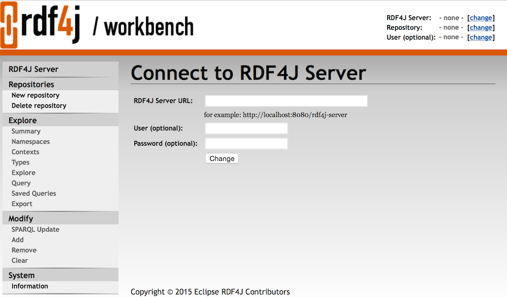

# Tools

### Installation

Download and unzip the latest `halyard-sdk-<version>.zip` bundle to an Apache Hadoop cluster node with a configured Apache HBase client.

### RDF4J Console

RDF4J Console is a command-line interactive application that provides a set of commands to operate several supported RDF4J SAIL implementations. Halyard (HBase SAIL) is included in this distribution.

The SAILs are executed within the Console local context by default or the Console can be used to connect to a remote server endpoint.

The Console represents an all-in-one user solution for experiments with various SAILs (based in-memory or on a local filesystem) as well as for Halyard (HBase SAIL) cluster connection. For use with Halyard (HBase SAIL) it is mandatory to execute the Console on a Hadoop & HBase configured cluster node.

```
$ ./console.sh
Connected to default data directory
RDF4J Console 2.2.2

2.2.2
Type 'help' for help.

> help
For more information on a specific command, try 'help <command>'.
List of all commands:
help        Displays this help message
info        Shows info about the console
connect     Connects to a (local or remote) set of repositories
disconnect  Disconnects from the current set of repositories
create      Creates a new repository
federate    Federate existing repositories.
drop        Drops a repository
open        Opens a repository to work on, takes a repository ID as argument
close       Closes the current repository
show        Displays an overview of various resources
load        Loads a data file into a repository, takes a file path or URL as argument
verify      Verifies the syntax of an RDF data file, takes a file path or URL as argument
clear       Removes data from a repository
sparql      Evaluate a SPARQL query
serql       Evaluate a SeRQL query
set         Allows various console parameters to be set
exit, quit  Exit the console
```

**Console usage:**

1. Open terminal on a Hadoop cluster node with a configured HBase.
2. Don't forget to `kinit` with your credentials if on a secured cluster.
3. You may optionally run the `hbase shell` tool and, for example, use the `list` command to verify the HBase connection and configuration.
4. Start `console` application from the unzipped Halyard bundle.
5. `create hbase` repository type that will map to the local HBase under your actual credentials. The repository template called `hbase` is added by Halyard to the standard set of RDF4J repository templates: `memory`, `native`, `remote`, etc. Don't be mistaken by **creation** of your local repository instance, it is just an instance of the connection settings to an HBase table. You may point multiple repository instances under various repository IDs to a single shared HBase table. The created instance is locally persisted under the actual user's home folder, so this step does not have to be repeated. The HBase repository settings are described in [this chapter](#settings).
6. `open <your repository ID>` - this is the time when Halyard connects to the associated HBase table or creates the table if missing (and if instructed to do so).
7. The instructions for the general use of the RDF4J Console are available via the `help` command or at: <http://docs.rdf4j.org/server-workbench-console/#_rdf4j_console>

### Halyard
```
$ ./halyard -h
usage: halyard [ -h | -v | <command> [<genericHadoopOptions>] [-h] ...]

commands are:
----------------------------------------------------------------------------------------------------
presplit   Halyard Presplit is a MapReduce application designed to estimate optimal HBase region
           splits for big datasets before the Bulk Load. Halyard PreSplit creates an empty HBase
           table based on calculations from the dataset sources sampling. For very large datasets it
           is wise to calculate the pre-splits before the HBase table is created to allow more
           efficient following Bulk Load process of the data. Optional definition or override of the
           named graph should be specified exactly the same as for the following Bulk Load process
           so the region presplits estimations are precise.
           Halyard PreSplit consumes the same RDF data sources as Halyard Bulk Load.
bulkload   Halyard Bulk Load is a MapReduce application designed to efficiently load RDF data from
           Hadoop Filesystem (HDFS) into HBase in the form of a Halyard dataset.
stats      Halyard Stats is a MapReduce application that calculates dataset statistics and stores
           them in the named graph within the dataset or exports them into a file. The generated
           statistics are described by the VoID vocabulary, its extensions, and the SPARQL 1.1
           Service Description.
esindex    Halyard ElasticSearch Index is a MapReduce application that indexes all literals in the
           given dataset into a supplementary ElasticSearch server/cluster. A Halyard repository
           configured with such supplementary ElasticSearch index can then provide more advanced
           text search features over the indexed literals.
update     Halyard Update is a command-line application designed to run SPARQL Update operations to
           transform data in an HBase Halyard dataset
bulkupdate Halyard Bulk Update is a MapReduce application that executes multiple SPARQL Update
           operations in parallel in the Mapper phase. The Shuffle and Reduce phase are responsible
           for the efficient update of the dataset in a bulk mode (similar to the Halyard Bulk
           Load). Halyard Bulk Update supports large-scale DELETE/INSERT operations that are not
           executed separately, but instead they are processed as a single atomic bulk operation at
           the end of the execution.
export     Halyard Export is a command-line application designed to export data from HBase (a
           Halyard dataset) into various targets and formats.
bulkexport Halyard Bulk Export is a MapReduce application that executes multiple Halyard Exports in
           MapReduce framework. Query file name (without extension) can be used in the target URL
           pattern. Order of queries execution is not guaranteed. Another internal level of
           parallelisation is done using a custom SPARQL function
           halyard:forkAndFilterBy(<constant_number_of_forks>, ?a_binding, ...). The function takes
           one or more bindings as its arguments and these bindings are used as keys to randomly
           distribute the query evaluation across the executed parallel forks of the same query.
bulkdelete Halyard Bulk Delete is a MapReduce application that effectively deletes large set of
           triples or whole named graphs, based on specified statement pattern and/or named
           graph(s).
profile    Halyard Profile is a command-line tool designed to profile SPARQL query performance
           within the actual Halyard environment. Actually it is limited to the statical analysis
           only.

genericHadoopOptions are:
----------------------------------------------------------------------------------------------------
-conf <configuration file>                   specify an application configuration file
-D <property=value>                          use value for given property
-fs <local|namenode:port>                    specify a namenode
-jt <local|jobtracker:port>                  specify a job tracker
-files <comma separated list of files>       specify comma separated files to be copied to the map
                                             reduce cluster
-archives <comma separated list of archives> specify comma separated archives to be unarchived on
                                             the compute machines.
```

### Halyard PreSplit
```
$ ./halyard presplit -h
usage: halyard presplit [-h] [-v] -s <source_paths> -t <dataset_table> [-i] [-g <named_graph>] [-o]
       [-d <decimation_factor>] [-l <size>]
Halyard Presplit is a MapReduce application designed to estimate optimal HBase region splits for big
datasets before the Bulk Load. Halyard PreSplit creates an empty HBase table based on calculations
from the dataset sources sampling. For very large datasets it is wise to calculate the pre-splits
before the HBase table is created to allow more efficient following Bulk Load process of the data.
Optional definition or override of the named graph should be specified exactly the same as for the
following Bulk Load process so the region presplits estimations are precise.
Halyard PreSplit consumes the same RDF data sources as Halyard Bulk Load.
 -h,--help                                    Prints this help
 -v,--version                                 Prints version
 -s,--source <source_paths>                   Source path(s) with RDF files, more paths can be
                                              delimited by comma, the paths are searched for the
                                              supported files recurrently
 -t,--target <dataset_table>                  Target HBase table with Halyard RDF store
 -i,--skip-invalid                            Optionally skip invalid source files and parsing
                                              errors
 -g,--default-named-graph <named_graph>       Optionally specify default target named graph
 -o,--named-graph-override                    Optionally override named graph also for quads, named
                                              graph is stripped from quads if --default-named-graph
                                              option is not specified
 -d,--decimation-factor <decimation_factor>   Optionally overide pre-split random decimation factor
                                              (default is 1000)
 -l,--split-limit-size <size>                 Optionally override calculated split size (default is
                                              80000000)
Example: halyard presplit -s hdfs://my_RDF_files -t mydataset
```

### Halyard Bulk Load
```
$ ./halyard bulkload -h
usage: halyard bulkload [-h] [-v] -s <source_paths> -w <shared_folder> -t <dataset_table> [-i] [-d]
       [-r] [-b <bits>] [-g <named_graph>] [-o] [-e <timestamp>] [-m <size_in_bytes>]
Halyard Bulk Load is a MapReduce application designed to efficiently load RDF data from Hadoop
Filesystem (HDFS) into HBase in the form of a Halyard dataset.
 -h,--help                                Prints this help
 -v,--version                             Prints version
 -s,--source <source_paths>               Source path(s) with RDF files, more paths can be delimited
                                          by comma, the paths are searched for the supported files
                                          recurrently
 -w,--work-dir <shared_folder>            Unique non-existent folder within shared filesystem to
                                          server as a working directory for the temporary HBase
                                          files,  the files are moved to their final HBase locations
                                          during the last stage of the load process
 -t,--target <dataset_table>              Target HBase table with Halyard RDF store
 -i,--skip-invalid                        Optionally skip invalid source files and parsing errors
 -d,--verify-data-types                   Optionally verify RDF data type values while parsing
 -r,--truncate-target                     Optionally truncate target table just before the loading
                                          the new data
 -b,--pre-split-bits <bits>               Optionally specify bit depth of region pre-splits for a
                                          case when target table does not exist (default is 3)
 -g,--default-named-graph <named_graph>   Optionally specify default target named graph
 -o,--named-graph-override                Optionally override named graph also for quads, named
                                          graph is stripped from quads if --default-named-graph
                                          option is not specified
 -e,--target-timestamp <timestamp>        Optionally specify timestamp of all loaded records
                                          (default is actual time of the operation)
 -m,--max-split-size <size_in_bytes>      Optionally override maximum input split size, where also
                                          significantly larger single files will be processed in
                                          parallel (0 means no limit, default is 200000000)
Halyard Bulk Load consumes RDF files in various formats supported by RDF4J RIO, including:
* N-Triples (.nt)
* RDF/XML (.rdf, .rdfs, .owl, .xml)
* Turtle (.ttl)
* N3 (.n3)
* RDF/JSON (.rj)
* TriG (.trig)
* N-Quads (.nq)
* BinaryRDF (.brf)
* JSON (.json)
* ND-JSON-LD (.ndjsonld)
* TriX (.xml, .trix)
* JSON-LD (.jsonld)
All the supported RDF formats can be also compressed with one of the compression codecs supported by
Hadoop, including:
* Gzip (.gz)
* Bzip2 (.bz2)
* LZO (.lzo)
* Snappy (.snappy)
Example: halyard bulkload -s hdfs://my_RDF_files -w hdfs:///my_tmp_workdir -t mydataset
```

### Halyard Stats
```
$ ./halyard stats -h
usage: halyard stats [-h] [-v] -s <dataset_table> [-t <target_url>] [-r <size>] [-c <named_graph>]
       [-g <target_graph>]
Halyard Stats is a MapReduce application that calculates dataset statistics and stores them in the
named graph within the dataset or exports them into a file. The generated statistics are described
by the VoID vocabulary, its extensions, and the SPARQL 1.1 Service Description.
 -h,--help                               Prints this help
 -v,--version                            Prints version
 -s,--source-dataset <dataset_table>     Source HBase table with Halyard RDF store
 -t,--target-file <target_url>           Optional target file to export the statistics (instead of
                                         update)
                                         hdfs://<path>/<file_name>[{0}].<RDF_ext>[.<compression>]
 -r,--threshold <size>                   Optional minimal size of a named graph to calculate
                                         statistics for (default is 1000)
 -c,--named-graph <named_graph>          Optional restrict stats calculation to the given named
                                         graph only
 -g,--stats-named-graph <target_graph>   Optional target named graph of the exported statistics
                                         (default is
                                         'http://merck.github.io/Halyard/ns#statsContext')
Example: halyard stats -s my_dataset [-g 'http://whatever/mystats'] [-t
hdfs:/my_folder/my_stats.trig]
```

**Sample statistics (in the [TriG](http://www.w3.org/TR/trig/) format):**

```
@prefix halyard:  <http://merck.github.io/Halyard/ns#> .
@prefix rdf:      <http://www.w3.org/1999/02/22-rdf-syntax-ns#> .
@prefix sd:       <http://www.w3.org/ns/sparql-service-description#> .
@prefix void-ext: <http://ldf.fi/void-ext#> .
@prefix void:     <http://rdfs.org/ns/void#> .
@prefix xsd:      <http://www.w3.org/2001/XMLSchema#> .

halyard:statsContext {
    halyard:statsRoot a void:Dataset, sd:Dataset, sd:Graph ;
        sd:defaultGraph halyard:statsRoot ;
        void:classes "1000"^^xsd:long ;
        void:triples "2300"^^xsd:long ;
        void:properties "112"^^xsd:long ;
        void-ext:distinctLiterals "889"^^xsd:long ;
        void:distinctObjects "1991"^^xsd:long ;
        void:distinctSubjects "229"^^xsd:long ;
        void-ext:distinctBlankNodeObjects "101"^^xsd:long ;
        void-ext:distinctBlankNodeSubjects "78"^^xsd:long ;
        void-ext:distinctIRIReferenceObjects "1001"^^xsd:long ;
        void-ext:distinctIRIReferenceSubjects "151"^^xsd:long ;
        sd:namedGraph <http://whatever/graph0>, <http://whatever/graph1> ;
        void-ext:subjectPartition halyard:statsRoot_subject__%3Abnodeid ;
        void-ext:subjectPartition halyard:statsRoot_subject_%3Chttp%3A%2F%2Ffrequent%2Firi%3E ;
        void:propertyPartition halyard:statsRoot_property_%3Chttp%3A%2F%2Fwww.w3.org%2F1999%2F02%2F22-rdf-syntax-ns%23type%3E ;
        void-ext:objectPartition halyard:statsRoot_object__%3Abnodeid ;
        void-ext:objectPartition halyard:statsRoot_object_%3Chttp%3A%2F%2Ffrequent%2Firi%3E ;
        void-ext:objectPartition halyard:statsRoot_object_%2242%22%5E%5E%3Chttp%3A%2F%2Fwww.w3.org%2F2001%2FXMLSchema%23int%3E .

    <http://whatever/graph0> a sd:NamedGraph, sd:Graph, void:Dataset ;
        sd:name <http://whatever/graph0> ;
        sd:graph <http://whatever/graph0> ;
        void:properties "112"^^xsd:long ;
        void-ext:distinctLiterals "356"^^xsd:long ;
        void:distinctObjects "801"^^xsd:long ;
        void:distinctSubjects "107"^^xsd:long ;
        void-ext:distinctBlankNodeObjects "44"^^xsd:long ;
        void-ext:distinctBlankNodeSubjects "32"^^xsd:long ;
        void-ext:distinctIRIReferenceObjects "401"^^xsd:long ;
        void-ext:distinctIRIReferenceSubjects "75"^^xsd:long ;
        void:classes "400"^^xsd:long ;
        void:triples "900"^^xsd:long ;
        void-ext:subjectPartition <http://whatever/graph0_subject__%3Abnodeid> ;
        void:propertyPartition <http://whatever/graph0_property_%3Chttp%3A%2F%2Fwww.w3.org%2F1999%2F02%2F22-rdf-syntax-ns%23type%3E> ;
        void-ext:objectPartition <http://whatever/graph0_object_%3Chttp%3A%2F%2Ffrequent%2Firi%3E> .

    <http://whatever/graph1> a sd:NamedGraph, sd:Graph, void:Dataset ;
        sd:name <http://whatever/graph1> ;
        sd:graph <http://whatever/graph1> ;
        void:classes "400"^^xsd:long ;
        void:triples "900"^^xsd:long ;
        void:properties "112"^^xsd:long ;
        void-ext:distinctLiterals "355"^^xsd:long ;
        void:distinctObjects "801"^^xsd:long ;
        void:distinctSubjects "106"^^xsd:long ;
        void-ext:distinctBlankNodeObjects "46"^^xsd:long ;
        void-ext:distinctBlankNodeSubjects "30"^^xsd:long ;
        void-ext:distinctIRIReferenceObjects "400"^^xsd:long ;
        void-ext:distinctIRIReferenceSubjects "76"^^xsd:long ;
        void-ext:subjectPartition <http://whatever/graph1_subject_%3Chttp%3A%2F%2Ffrequent%2Firi%3E> ;
        void:propertyPartition <http://whatever/graph1_property_%3Chttp%3A%2F%2Fwww.w3.org%2F1999%2F02%2F22-rdf-syntax-ns%23type%3E> ;
        void-ext:objectPartition <http://whatever/graph1_object__%3Abnodeid> .

    halyard:statsRoot_object__%3Abnodeid a void:Dataset ;
        void-ext:object _:bnodeid ;
        void:triples "100"^^xsd:long .

    halyard:statsRoot_object_%3Chttp%3A%2F%2Ffrequent%2Firi%3E a void:Dataset ;
        void-ext:object <http://frequent/iri> ;
        void:triples "100"^^xsd:long .

    halyard:statsRoot_object_%2242%22%5E%5E%3Chttp%3A%2F%2Fwww.w3.org%2F2001%2FXMLSchema%23int%3E a void:Dataset ;
        void-ext:object "42"^^xsd:long ;
        void:triples "100"^^xsd:long .

    halyard:statsRoot_subject__%3Abnodeid a void:Dataset ;
        void-ext:subject _:bnodeid ;
        void:triples "200"^^xsd:long .

    halyard:statsRoot_subject_%3Chttp%3A%2F%2Ffrequent%2Firi%3E a void:Dataset ;
        void-ext:subject <http://frequent/iri> ;
        void:triples "100"^^xsd:long .

    halyard:statsRoot_property_%3Chttp%3A%2F%2Fwww.w3.org%2F1999%2F02%2F22-rdf-syntax-ns%23type%3E a void:Dataset ;
        void:property rdf:type ;
        void:triples "1000"^^xsd:long .

    <http://whatever/graph0_object_%3Chttp%3A%2F%2Ffrequent%2Firi%3E> a void:Dataset ;
        void-ext:object <http://frequent/iri> ;
        void:triples "100"^^xsd:long .

    <http://whatever/graph0_subject__%3Abnodeid> a void:Dataset ;
        void-ext:subject _:bnodeid ;
        void:triples "100"^^xsd:long .

    <http://whatever/graph0_property_%3Chttp%3A%2F%2Fwww.w3.org%2F1999%2F02%2F22-rdf-syntax-ns%23type%3E> a void:Dataset ;
        void:property rdf:type ;
        void:triples "400"^^xsd:long .

    <http://whatever/graph1_object__%3Abnodeid> a void:Dataset ;
        void-ext:object _:bnodeid ;
        void:triples "100"^^xsd:long .

    <http://whatever/graph1_subject_%3Chttp%3A%2F%2Ffrequent%2Firi%3E> a void:Dataset ;
        void-ext:subject <http://frequent/iri> ;
        void:triples "100"^^xsd:long .

    <http://whatever/graph1_property_%3Chttp%3A%2F%2Fwww.w3.org%2F1999%2F02%2F22-rdf-syntax-ns%23type%3E> a void:Dataset ;
        void:property rdf:type ;
        void:triples "400"^^xsd:long .
}
```
### Halyard ElasticSearch Index <a id="Halyard_ElasticSearch_Index"></a>
```
$ ./halyard esindex -h
usage: halyard esindex [-h] [-v] -s <dataset_table> -t <target_url> [-c] [-d <document_type>] [-a
       <attribute_name>] [-b <batch_size>]
Halyard ElasticSearch Index is a MapReduce application that indexes all literals in the given
dataset into a supplementary ElasticSearch server/cluster. A Halyard repository configured with such
supplementary ElasticSearch index can then provide more advanced text search features over the
indexed literals.
 -h,--help                              Prints this help
 -v,--version                           Prints version
 -s,--source-dataset <dataset_table>    Source HBase table with Halyard RDF store
 -t,--target-index <target_url>         Elasticsearch target index url <server>:<port>/<index_name>
 -c,--create-index                      Optionally create Elasticsearch index
 -d,--document-type <document_type>     Optionally specify document type within the index, default
                                        is 'l'
 -a,--attribute-name <attribute_name>   Optionally specify attribute name to index literals within
                                        the document, default is 'l'
 -b,--batch-size <batch_size>           Number of literals sent to Elasticsearch for indexing in one
                                        batch (default is 100000)
Default index mapping is:
 {
     "mappings" : {
         "l" : {
             "properties" : {
                 "l" : { "type" : "text" }
             },
             "_source" : {
               "enabled" : false
             }
         }
     }
 }
Example: halyard esindex -s my_dataset -t http://my_elastic.my.org:9200/my_index
```

### Halyard Update
```
$ ./halyard update -h
usage: halyard update [-h] [-v] -s <dataset_table> -q <sparql_update_operation> [-e
       <elastic_index_url>]
Halyard Update is a command-line application designed to run SPARQL Update operations to transform
data in an HBase Halyard dataset
 -h,--help                                         Prints this help
 -v,--version                                      Prints version
 -s,--source-dataset <dataset_table>               Source HBase table with Halyard RDF store
 -q,--update-operation <sparql_update_operation>   SPARQL update operation to be executed
 -e,--elastic-index <elastic_index_url>            Optional ElasticSearch index URL
Example: halyard update -s my_dataset -q 'insert {?o owl:sameAs ?s} where {?s owl:sameAs ?o}'
```

### Halyard Bulk Update <a id="Halyard_Bulk_Update"></a>
```
$ ./halyard bulkupdate -h
usage: halyard bulkupdate [-h] [-v] -s <dataset_table> -q <sparql_update_operations> -w
       <shared_folder> [-e <timestamp>]
Halyard Bulk Update is a MapReduce application that executes multiple SPARQL Update operations in
parallel in the Mapper phase. The Shuffle and Reduce phase are responsible for the efficient update
of the dataset in a bulk mode (similar to the Halyard Bulk Load). Halyard Bulk Update supports
large-scale DELETE/INSERT operations that are not executed separately, but instead they are
processed as a single atomic bulk operation at the end of the execution.
 -h,--help                                           Prints this help
 -v,--version                                        Prints version
 -s,--source-dataset <dataset_table>                 Source HBase table with Halyard RDF store
 -q,--update-operations <sparql_update_operations>   folder or path pattern with SPARQL update
                                                     operations
 -w,--work-dir <shared_folder>                       Unique non-existent folder within shared
                                                     filesystem to server as a working directory for
                                                     the temporary HBase files,  the files are moved
                                                     to their final HBase locations during the last
                                                     stage of the load process
 -e,--target-timestamp <timestamp>                   Optionally specify timestamp of all loaded
                                                     records (default is actual time of the
                                                     operation)
Example: halyard bulkupdate -s my_dataset -q hdfs:///myupdates/*.sparql -w hdfs:///my_tmp_workdir
```

### Halyard Export
```
$ ./halyard export -h
usage: halyard export [-h] [-v] -s <dataset_table> -q <sparql_query> -t <target_url> [-p
       <property=value>] [-l <driver_classpath>] [-c <driver_class>] [-r] [-e <elastic_index_url>]
Halyard Export is a command-line application designed to export data from HBase (a Halyard dataset)
into various targets and formats.
 -h,--help                                       Prints this help
 -v,--version                                    Prints version
 -s,--source-dataset <dataset_table>             Source HBase table with Halyard RDF store
 -q,--query <sparql_query>                       SPARQL tuple or graph query executed to export the
                                                 data
 -t,--target-url <target_url>                    file://<path>/<file_name>.<ext> or
                                                 hdfs://<path>/<file_name>.<ext> or
                                                 jdbc:<jdbc_connection>/<table_name>
 -p,--jdbc-property <property=value>             JDBC connection property, the most frequent JDBC
                                                 connection properties are -p
                                                 user=<jdbc_connection_username> and -p
                                                 password=<jdbc_connection_password>`
 -l,--jdbc-driver-classpath <driver_classpath>   JDBC driver classpath delimited by ':'
 -c,--jdbc-driver-class <driver_class>           JDBC driver class name, mandatory for JDBC export
 -r,--trim                                       Trim target table before export (apply for JDBC
                                                 only)
 -e,--elastic-index <elastic_index_url>          Optional ElasticSearch index URL
The exported data is determined by a SPARQL query. It can be either a SELECT query that produces a
set of tuples (a table) or a CONSTRUCT/DESCRIBE query that produces a set of triples (a graph). The
supported target systems, query types, formats, and compressions are listed in the following table:
+-----------+----------+-------------------------------+---------------------------------------+
| Target    | Protocol | SELECT query                  | CONSTRUCT/DESCRIBE query              |
+-----------+----------+-------------------------------+---------------------------------------+
| Local FS  | file:    | .csv + compression            | RDF4J supported formats + compression |
| Hadoop FS | hdfs:    | .csv + compression            | RDF4J supported formats + compression |
| Database  | jdbc:    | direct mapping to tab.columns | not supported                         |
| Dry run   | null:    | .csv + compression            | RDF4J supported formats + compression |
+-----------+----------+-------------------------------+---------------------------------------+
Other Hadoop standard and optional filesystems (like s3:, s3n:, file:, ftp:, webhdfs:) may work
according to the actual cluster configuration, however they have not been tested.
Optional compressions are:
* Bzip2 (.bz2)
* Gzip (.gz)
The RDF4J supported RDF formats are:
* N-Triples (.nt)
* RDF/XML (.rdf, .rdfs, .owl, .xml)
* Turtle (.ttl)
* N3 (.n3)
* RDF/JSON (.rj)
* TriG (.trig)
* N-Quads (.nq)
* BinaryRDF (.brf)
* TriX (.xml, .trix)
* JSON-LD (.jsonld)
Example: halyard export -s my_dataset -q 'select * where {?subjet ?predicate ?object}' -t
hdfs:/my_folder/my_data.csv.gz
```

### Halyard Parallel Export <a id="Halyard_Parallel_Export"></a>
Halyard Parallel Export tool become obsolete and all its functionality has been included in Halyard Bulk Export.

### Halyard Bulk Export <a id="Halyard_Bulk_Export"></a>
```
$ ./halyard bulkexport -h
usage: halyard bulkexport [-h] [-v] -s <dataset_table> -q <sparql_queries> -t <target_url> [-p
       <property=value>] [-l <driver_classpath>] [-c <driver_class>]
Halyard Bulk Export is a MapReduce application that executes multiple Halyard Exports in MapReduce
framework. Query file name (without extension) can be used in the target URL pattern. Order of
queries execution is not guaranteed. Another internal level of parallelisation is done using a
custom SPARQL function halyard:forkAndFilterBy(<constant_number_of_forks>, ?a_binding, ...). The
function takes one or more bindings as its arguments and these bindings are used as keys to randomly
distribute the query evaluation across the executed parallel forks of the same query.
 -h,--help                                       Prints this help
 -v,--version                                    Prints version
 -s,--source-dataset <dataset_table>             Source HBase table with Halyard RDF store
 -q,--queries <sparql_queries>                   folder or path pattern with SPARQL tuple or graph
                                                 queries
 -t,--target-url <target_url>                    file://<path>/{0}-{1}.<ext> or
                                                 hdfs://<path>/{0}-{1}.<ext> or
                                                 jdbc:<jdbc_connection>/{0}, where {0} is replaced
                                                 query filename (without extension) and {1} is
                                                 replaced with parallel fork index (when
                                                 http://merck.github.io/Halyard/ns#forkAndFilterBy
                                                 function is used in the particular query)
 -p,--jdbc-property <property=value>             JDBC connection property
 -l,--jdbc-driver-classpath <driver_classpath>   JDBC driver classpath delimited by ':'
 -c,--jdbc-driver-class <driver_class>           JDBC driver class name
Example: halyard bulkexport -s my_dataset -q hdfs:///myqueries/*.sparql -t
hdfs:/my_folder/{0}-{1}.csv.gz
```

### Halyard Bulk Delete
```
$ ./halyard bulkdelete -h
usage: halyard bulkdelete [-h] [-v] -t <dataset_table> -f <temporary_folder> [-s <subject>] [-p
       <predicate>] [-o <object>] [-g <named_graph>]
Halyard Bulk Delete is a MapReduce application that effectively deletes large set of triples or
whole named graphs, based on specified statement pattern and/or named graph(s).
 -h,--help                             Prints this help
 -v,--version                          Prints version
 -t,--target-dataset <dataset_table>   HBase table with Halyard RDF store
 -f,--temp-folder <temporary_folder>   Temporary folder for HBase files
 -s,--subject <subject>                Optional subject to delete
 -p,--predicate <predicate>            Optional predicate to delete
 -o,--object <object>                  Optional object to delete
 -g,--named-graph <named_graph>        Optional named graph(s) to delete, NONE represents triples
                                       outside of any named graph
Example: halyard bulkdelete -t my_data -f bulkdelete_temp1 -s <http://whatever/mysubj> -g
<http://whatever/mygraph1> -g <http://whatever/mygraph2>
```

### Halyard Profile
```
$ ./halyard profile -h
usage: halyard profile [-h] [-v] -s <dataset_table> -q <sparql_query>
Halyard Profile is a command-line tool designed to profile SPARQL query performance within the
actual Halyard environment. Actually it is limited to the statical analysis only.
 -h,--help                             Prints this help
 -v,--version                          Prints version
 -s,--source-dataset <dataset_table>   Source HBase table with Halyard RDF store
 -q,--query <sparql_query>             SPARQL query to profile
Example: halyard profile -s my_dataset -q 'select * where {?s owl:sameAs ?o}'
```

### RDF4J Web Applications

#### Installation

1. Install Apache Tomcat 8 (or similar) server on a configured Hadoop and HBase cluster node.
2. On a secured cluster create a service account and assign it adequate permissions for HDFS and HBase. Don't forget to setup a process to assure the user running the Apache Tomcat is always authenticated in Kerberos.
3. Secure the Apache Tomcat server as necessary.
4. Add the Apache Hadoop and the Apache HBase classpaths to the Tomcat classpath by creating `setenv.sh` file in the Apache Tomcat `bin` folder, with the content: ``` export CLASSPATH="$CATALINA_HOME/lib/servlet-api.jar:"`hadoop classpath`:`hbase classpath` ```
5. Download `rdf4j-server.war` and `rdf4j-workbench.war` application bundles from the Halyard distribution into the Apache Tomcat (into folder `webapps`).
6. Start the Apache Tomcat server (if not already started) and check logs if both applications started correctly.
7. Open a web browser and verify the connection to `<Apache_Tomcat_address>/rdf4j-workbench` by creating a repository. If the server authentication is enabled, you have to enter the credentials into the workbench to allow connections between rdf4j-workbench and rdf4j-server applications. Entering the right location of the `<Apache_Tomcat_address>/rdf4j-server` into the workbench might be required too.
8. More information about the RDF4J Server and Workbench can be found [here](http://docs.rdf4j.org/server-workbench-console).

#### RDF4J Server

RDF4J Server is a service server that provides a SPARQL endpoint for each managed repository as well as the REST access to the repository management functions.

More details about the RDF4J REST Protocol are described [here](http://docs.rdf4j.org/rest-api).

### RDF4J Workbench



RDF4J Workbench is a web client application for the RDF4J Server. It provides a user interface to manage the repositories, load, query, update, and explore RDF data of the connected RDF4J Server. More information about the RDF4J Workbench can be found [here](http://docs.rdf4j.org/server-workbench-console/#_rdf4j_workbench).
