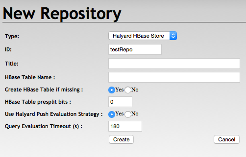
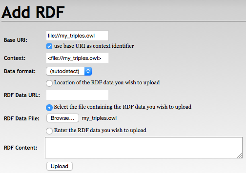
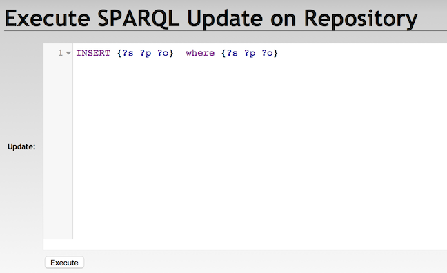
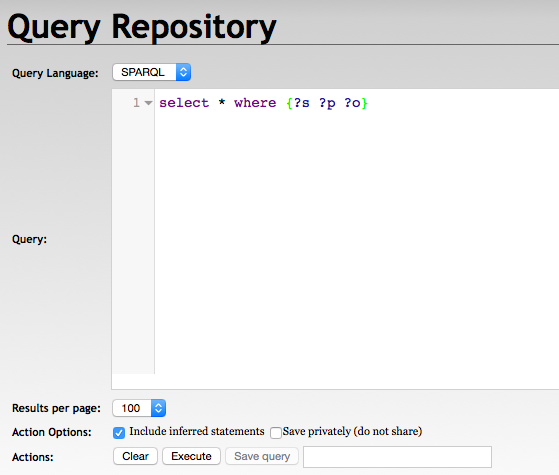
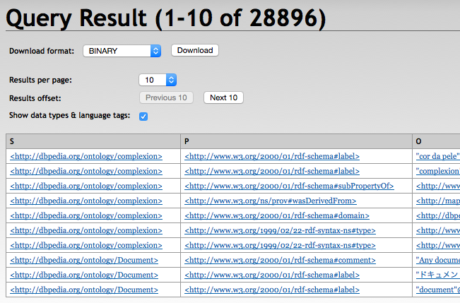
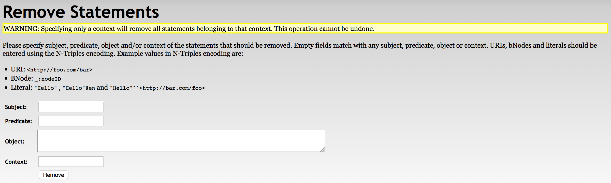
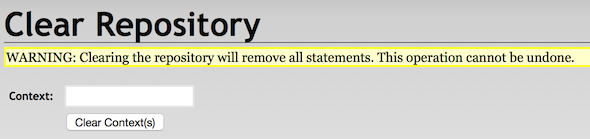

# Usage

## Before you begin

RDF4J repositories represent just configured connectors to a particular RDF storage. The repositories are always created and persisted within the actual context. RDF4J Console repository configuration is persisted under the actual user home directory. Repositories created via the RDF4J Workbench exist within the actually connected RDF4J Server context only.

Halyard datasets with all the RDF data are persisted as HBase tables. The corresponding Halyard dataset can be optionally created when the repository is created.

Multiple repositories configured in various RDF4J Servers or in multiple RDF4J Consoles can share one common Halyard dataset and so point to the same HBase table.

**Deleting a repository** from a particular RDF4J Server or RDF4J Console does not delete the associated Halyard dataset and so it does not affect the data and other users. However **clearing** the repository or **deleting its statements** has global effect for all users.

## Create repository <a id="Create_repository"></a>

### HBase repository settings

* **Repository ID** is mandatory and may correspond to the HBase table name.
* **Repository title** is optional.
* **HBase table name** can be left empty when the table name corresponds to the Repository ID.
* **Create HBase table if missing**: table presplit bits are ignored in case the table is not created.
* **HBase table presplit bits**: keep the default value 0, unless you expect a very large dataset.
* **Use Halyard Push Evaluation Strategy**: may be set to false to fallback to the default RDF4J evaluation strategy implementation.
* **Query Evaluation Timeout** may be adjusted or set to 0, however, it creates a risk of resource exhaustion if long timeouts are allowed.
* **Optional ElasticSearch Index URL**: URL of the supplementary ElasticSearch index with indexed literals for advanced text search capabilities.

### With RDF4J Console

```
> create hbase
Please specify values for the following variables:
Repository ID: testRepo
Repository title:
HBase Table Name:
Create HBase Table if missing (true|false) [true]:
HBase Table presplit bits [0]:
Use Halyard Push Evaluation Strategy (true|false) [true]:
Query Evaluation Timeout [180]:
Optional ElasticSearch Index URL:
Repository created
```

### With RDF4J Workbench



## Connect to the existing repository

### From RDF4J Console

```
> open testRepo
Opened repository 'testRepo'
```

### From RDF4J Workbench

Just select the repository from the list of repositories.

A newly created repository is connected automatically in the RDF4J Workbench.

## Load RDF data

### With Halyard Bulk Load

```
> ./halyard bulkload -s /my_hdfs_path/my_triples.owl -w /my_hdfs_temp_path -t testRepo
impl.YarnClientImpl: Submitted application application_1458475483810_40875
mapreduce.Job: The url to track the job: http://my_app_master/proxy/application_1458475483810_40875/
mapreduce.Job:  map 0% reduce 0%
mapreduce.Job:  map 100% reduce 0%
mapreduce.Job:  map 100% reduce 100%
mapreduce.Job: Job job_1458475483810_40875 completed successfully
INFO: Bulk Load Completed..
```

Note: Before Bulk Load of very large datasets into a new HBase table it is recommended to use the Halyard PreSplit. Halyard PreSplit calculates the HBase table region splits and creates the HBase table optimized for the following Bulk Load process. 

### With RDF4J Console

```
testRepo> load /home/user/my_triples.owl
Loading data...
Data has been added to the repository (2622 ms)
```

### With RDF4J Workbench



### With RDF4J Server SPARQL endpoint REST APIs

```
PUT /rdf4j-server/repositories/testRepo/statements HTTP/1.1
Content-Type: application/rdf+xml;charset=UTF-8

[RDF/XML ENCODED RDF DATA]
```

## SPARQL federated queries across datasets

Each Halyard dataset represents a separate [RDF dataset](https://www.w3.org/TR/rdf11-concepts/#section-dataset). In order to issue SPARQL queries across multiple datasets it is possible to:

1. Merge all the required datasets into one, as described later in this document.
2. Use the SPARQL SERVICE clause to federate queries across multiple datasets.

Halyard resolves directly accessible HBase tables (datasets) as federation services. Halyard service URL for each dataset is constructed from the Halyard prefix `http://merck.github.io/Halyard/ns#` and the table name.

For example, we have datasets `dataset1` and `dataset2`. While querying `dataset1`, we can use the following SPARQL query to also access data from `dataset2`:

```
PREFIX halyard: <http://merck.github.io/Halyard/ns#>

SELECT *
  WHERE {
    SERVICE halyard:dataset2 {
      ?s ?p ?o .
    }
  }
```

This query can be used by any of the above-described ways or tools (Console, Workbench, REST API, Halyard Update, Export, or Parallel Export). No other federated service types, such as external SPARQL endpoints, are recognised.

## SPARQL Update

### With Halyard Update

```
./halyard update -s testRepo -q 'INSERT { ?s ?p ?o . } WHERE { ?s ?p ?o . }'
```

### With Halyard Bulk Update

```
> ./halyard bulkupdate -q /my_hdfs_path/my_update_queries.sparql -w /my_hdfs_temp_path -s testRepo
impl.YarnClientImpl: Submitted application application_1458476924873_30975
mapreduce.Job: The url to track the job: http://my_app_master/proxy/application_1458476924873_30975/
mapreduce.Job:  map 0% reduce 0%
mapreduce.Job:  map 100% reduce 0%
mapreduce.Job:  map 100% reduce 100%
mapreduce.Job: Job job_1458476924873_30975 completed successfully
INFO: Bulk Update Load Completed..
```

### With RDF4J Console

```
testRepo> sparql
enter multi-line SPARQL query (terminate with line containing single '.')
insert {?s ?p ?o} where {?s ?p ?o}
.
Executing update...
Update executed in 800 ms
```

### With RDF4J Workbench



### With RDF4J Server SPARQL endpoint REST APIs

```
POST /rdf4j-server/repositories/testRepo/statements HTTP/1.1
Content-Type: application/x-www-form-urlencoded

update=INSERT%20{?s%20?p%20?o}%20WHERE%20{?s%20?p%20?o}
```

## SPARQL query and export data

### With Halyard Export

```
> ./halyard export -s testRepo -q 'select * where {?s ?p ?o}' -t file:///my_path/my_export.csv
INFO: Query execution started
INFO: Export finished
```

Note: additional debugging information may appear in the output of the Halyard Export execution.

### With Halyard Parallel Export

```
> ./halyard pexport -j 10 -s testRepo -q 'PREFIX halyard: <http://merck.github.io/Halyard/ns#> select * where {?s ?p ?o . FILTER (halyard:parallelSplitBy (?s))}' -t hdfs:///my_path/my_export{0}.csv
impl.YarnClientImpl: Submitted application application_1572718538572_94727
mapreduce.Job: The url to track the job: http://my_app_master/proxy/application_1572718538572_94727/
mapreduce.Job:  map 0% reduce 0%
mapreduce.Job:  map 100% reduce 0%
mapreduce.Job: Job job_1572718538572_94727 completed successfully
INFO: Parallel Export Completed..
```

### With RDF4J Console

```
testRepo> sparql
enter multi-line SPARQL query (terminate with line containing single '.')
SELECT * WHERE { ?s ?p ?o . } LIMIT 10
.
Evaluating SPARQL query...
+------------------------+------------------------+------------------------+
| s                      | p                      | o                      |
+------------------------+------------------------+------------------------+
| :complexion            | rdfs:label             | "cor da pele"@pt       |
| :complexion            | rdfs:label             | "complexion"@en        |
| :complexion            | rdfs:subPropertyOf     | dul:hasQuality         |
| :complexion            | prov:wasDerivedFrom    | <http://mappings.dbpedia.org/index.php/OntologyProperty:complexion>|
| :complexion            | rdfs:domain            | :Person                |
| :complexion            | rdf:type               | owl:ObjectProperty     |
| :complexion            | rdf:type               | rdf:Property           |
| :Document              | rdfs:comment           | "Any document"@en      |
| :Document              | rdfs:label             | "\u30C9\u30AD\u30E5\u30E1\u30F3\u30C8"@ja|
| :Document              | rdfs:label             | "document"@en          |
+------------------------+------------------------+------------------------+
10 result(s) (51 ms)
```

### With RDF4J Workbench






### With RDF4J Server SPARQL endpoint REST APIs

```
GET /rdf4j-server/repositories/testRepo?query=select+*+where+%7B%3Fs+%3Fp+%3Fo%7D HTTP/1.1
Accept: application/sparql-results+xml, */*;q=0.5
```

## Delete statements

### With Halyard Update

```
./halyard update -s testRepo -q 'DELETE { ?s ?p ?o . } WHERE { ?s ?p ?o . }'
```

### With RDF4J Workbench

{:width="100%"}

### With RDF4J Server SPARQL endpoint REST APIs

```
DELETE /rdf4j-server/repositories/testRepo/statements?subj=&pred=&obj= HTTP/1.1

```

## Clear repository

### With RDF4J Console

```
testRepo> clear
Clearing repository...
```

### With RDF4J Workbench



### With RDF4J Server SPARQL endpoint REST APIs

```
DELETE /rdf4j-server/repositories/testRepo/statements HTTP/1.1
```

## HBase shell dataset operations

### Snapshot Halyard dataset

```
> hbase shell
HBase Shell; enter 'help<RETURN>' for list of supported commands.
Type "exit<RETURN>" to leave the HBase Shell
Version 1.1.2.2.4.2.0-258

hbase(main):001:0> snapshot 'testRepo', 'testRepo_my_snapshot'
0 row(s) in 36.3380 seconds
```

### Clone Halyard dataset from snapshot

```
> hbase shell
HBase Shell; enter 'help<RETURN>' for list of supported commands.
Type "exit<RETURN>" to leave the HBase Shell
Version 1.1.2.2.4.2.0-258

hbase(main):001:0> clone_snapshot 'testRepo_my_snapshot', 'testRepo2'
0 row(s) in 31.1590 seconds
```

### Export Halyard dataset snapshot

```
> hbase org.apache.hadoop.hbase.snapshot.ExportSnapshot -snapshot testRepo_my_snapshot -copy-to /my_hdfs_export_path
2016-04-28 09:01:07,019 INFO  [main] snapshot.ExportSnapshot: Loading Snapshot hfile list
2016-04-28 09:01:07,427 INFO  [main] snapshot.ExportSnapshot: Copy Snapshot Manifest
2016-04-28 09:01:11,704 INFO  [main] impl.YarnClientImpl: Submitted application application_1458475483810_41563
2016-04-28 09:01:11,826 INFO  [main] mapreduce.Job: The url to track the job: http://my_app_master/proxy/application_1458475483810_41563/
2016-04-28 09:01:19,956 INFO  [main] mapreduce.Job:  map 0% reduce 0%
2016-04-28 09:01:29,031 INFO  [main] mapreduce.Job:  map 100% reduce 0%
2016-04-28 09:01:29,039 INFO  [main] mapreduce.Job: Job job_1458475483810_41563 completed successfully
2016-04-28 09:01:29,158 INFO  [main] snapshot.ExportSnapshot: Finalize the Snapshot Export
2016-04-28 09:01:29,164 INFO  [main] snapshot.ExportSnapshot: Verify snapshot integrity
2016-04-28 09:01:29,193 INFO  [main] snapshot.ExportSnapshot: Export Completed: testRepo_my_snapshot
```

Note: the above listing skips much debugging information from the MapReduce execution.

### Bulk merge of multiple datasets

1. Snapshot and export all Halyard datasets you want to merge. <br>
  (see the above-described processes) 
2. Merge the exported files <br>
  Exported HBase files are organised under the target folder in the following structure: `/archive/data/<table_namespace>/<table_name>/<region_id>/<column_family>/<region_files>`. We need to merge the region files under each column family from all exports into a single structure. <br>
  As Halyard dataset currently contains only the `e` column family, it can be achieved, for example, by following commands: <br>
  `> hdfs dfs -mkdir -p /my_hdfs_merged_path/e` <br>
  `> hdfs dfs -mv /my_hdfs_export_path/archive/data/*/*/*/e/* /my_hdfs_merged_path/e`
3. Create a new Halyard dataset. <br>
  (see the above-described process)
4. Load the merged files <br>
  `> hbase org.apache.hadoop.hbase.mapreduce.LoadIncrementalHFiles /my_hdfs_merged_path new_dataset_table_name`

### Boost query performance by making datasets read-only

```
> hbase shell
HBase Shell; enter 'help<RETURN>' for list of supported commands.
Type "exit<RETURN>" to leave the HBase Shell
Version 1.1.2.2.4.2.0-258

hbase(main):001:0> alter 'testRepo', READONLY => 'true'
Updating all regions with the new schema...
0/3 regions updated.
3/3 regions updated.
Done.
0 row(s) in 2.2210 seconds
```

### Disable/enable unused dataset to save HBase resources

```
> hbase shell
HBase Shell; enter 'help<RETURN>' for list of supported commands.
Type "exit<RETURN>" to leave the HBase Shell
Version 1.1.2.2.4.2.0-258

hbase(main):001:0> disable 'testRepo'
0 row(s) in 1.3040 seconds
```

```
> hbase shell
HBase Shell; enter 'help<RETURN>' for list of supported commands.
Type "exit<RETURN>" to leave the HBase Shell
Version 1.1.2.2.4.2.0-258

hbase(main):001:0> enable 'testRepo'
0 row(s) in 1.2130 seconds
```

### Delete dataset

```
> hbase shell
HBase Shell; enter 'help<RETURN>' for list of supported commands.
Type "exit<RETURN>" to leave the HBase Shell
Version 1.1.2.2.4.2.0-258

hbase(main):001:0> disable 'testRepo'
0 row(s) in 1.2750 seconds

hbase(main):002:0> drop 'testRepo'
0 row(s) in 0.2070 seconds
```

## Cooperation with ElasticSearch
### Prerequisites
Halyard expect pre-installed ElasticSearch server accessible through REST APIs and pre-configured index(es). Index requirements are minimal: there are no stored attributes, just `_id` and reverse search index for attribute named `l`.

Halyard indexes only each individual literal values from the statement objects, so the resulting index is small and efficient. One index can be shared across multiple Halyard datasets. 

### Indexing of literals in ElasticSearch
Halyard only cooperates with ElasticSearch indexes loaded by [Halyard ElasticSearch Index](https://merck.github.io/Halyard/tools.html#Halyard_ElasticSearch_Index) tool.

### Dataset configuration to cooperate with Elastic Search
Only dataset configured with reference to the ElasticSearch index cooperates with the index to search for literals. Please follow instructions at [Create repository](#Create_repository) section above in this document.

### Custom search data type usage
Custom data type <a id="search" href="http://merck.github.io/Halyard/ns#search">`halyard:search`</a> is used to pass the value as a query string to Elastic Search index (when configured). The value is replaced with all matching values retrieved from Elastic Search index during SPARQL query, during direct API repository operations, or during RDF4J Workbench exploration of the datasets. 

For example `"(search~1 algorithm~1) AND (grant ingersoll)"^^halyard:search` will execute a fuzzy search over all indexed literals for the terms “search algorithm” and “grant ingersoll”. And it will pass relevant literals back to the statement evaluation where used in SPARQL query or RDF4J API or in Explorer. 

The whole SPARQL query that will retrieve subject(s) and predicate(s) related to the found literals might for example look like this:

```
SELECT ?subj ?pred
WHERE {
    ?subj ?pred "(search~1 algorithm~1) AND (grant ingersoll)"^^halyard:search
}
```

The cooperation with ElasticSearch is implemented on a very low level, so it can be used almost anywhere, including:

 * In SPARQL queries or updates anywhere in Console, Workbench, API, or Halyard command line and MapReduce tools
 * In statements retrieval or deletion through Console, Workbench, or API
 * In RDF4J Workbench Explorer